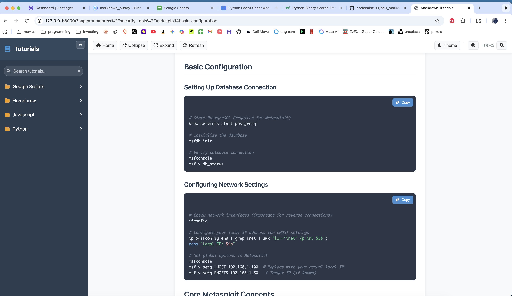
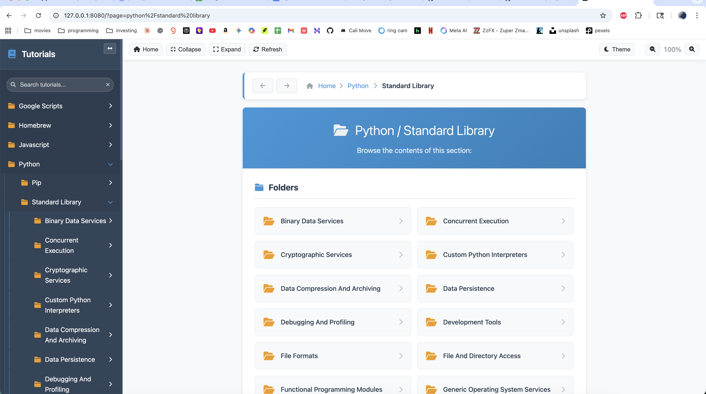

# Markdown Tutorials

A modern, feature-rich web application for browsing and viewing markdown-based tutorials with advanced search, bookmarking, progress tracking, and responsive design.

## 🚀 Latest Features & Improvements

### Enhanced User Experience

- **🔍 Fuzzy Search System** - Smart search with highlighting, suggestions, and history
- **📖 Reading Progress Tracking** - Automatic progress tracking with visual indicators
- **🔖 Advanced Bookmark System** - One-click bookmarking with progress persistence
- **📱 Quick Actions Menu** - Floating action button with bookmark, history, print, and share
- **⏱️ Recent History** - Automatically tracks and displays recently viewed tutorials
- **⌨️ Enhanced Keyboard Shortcuts** - Comprehensive shortcuts for power users
- **🔔 Smart Notifications** - Toast notifications for user actions and feedback
- **🎨 Improved Dark Theme** - Complete dark mode support for all features
- **🖨️ Print-Optimized Styles** - Clean print layout removing navigation elements
- **♿ Better Accessibility** - Keyboard navigation, focus styles, and ARIA labels
- **📱 Mobile Enhancements** - Touch-friendly interactions and responsive design
- **🧭 Right‑rail Sticky Table of Contents** - Always-visible ToC with scrollspy highlighting and persisted visibility
- **🧰 Code-friendly Layout** - Wider content column, larger inter-column gap, and per-article zoom that doesn’t affect the ToC


## Related: neu_markdown_buddy (desktop, web, cloud)

If you prefer a native desktop experience, check out neu_markdown_buddy — a cross‑platform NeutralinoJS port of this project for macOS, Windows, and Linux.

- Repository: [codecaine-zz/neu_markdown_buddy](https://github.com/codecaine-zz/neu_markdown_buddy)
- Platforms: macOS, Windows, Linux (desktop); core UI also runs in a regular browser
- Highlights: advanced navigation, smart search, ToC, code copy, theme + zoom, random tutorial, and persistent UI state

Quick desktop start (summary):

- Install Node.js or Bun and the NeutralinoJS CLI (@neutralinojs/neu)
- In the neu_markdown_buddy repo: run `neu update`, then `neu run` for dev or `neu build` for distributable binaries

Use your existing tutorials with the desktop app:

- Copy or symlink this repo's `tutorials/` into neu_markdown_buddy at `resources/tutorials/` to browse the same content in the desktop UI

Website/cloud usage options:

- Host this PHP app (current repo) on any PHP-capable server or platform (see Installation below)
- Or serve neu_markdown_buddy's `resources/` (index.html, styles, main.js, libs) as a static site; desktop‑only features (e.g., tray, always‑on‑top, native FS access) won't apply in browsers, but the core reader/navigation work well

## Features

### Core Functionality

- 📚 **Interactive Tutorial Browser** - Navigate through organized tutorial collections
- 🎨 **Syntax Highlighting** - Code blocks highlighted with Highlight.js for 20+ languages
- 📱 **Responsive Design** - Works seamlessly on desktop and mobile devices
- 📋 **Copy to Clipboard** - One-click copying for all code blocks
- 🧭 **Smart Navigation** - Breadcrumb navigation and expandable folder structure
- 🔍 **Search & Discovery** - Sidebar search with live filtering and auto-expanding results
- 🧩 **Auto-Display Table of Contents** - TOC automatically appears for all tutorials with dynamic toggle functionality
- 🧱 **Sidebar Width Toggle** - Expand/collapse the sidebar for focus or overview
- 🎯 **Smooth Scrolling** - In-page anchor navigation with smooth scrolling and target highlight
- 🧰 **Top Toolbar** - Home, Collapse/Expand All, Refresh, Theme, and Zoom controls
- 🌗 **Theme Toggle** - Light/Dark theme with instant switch and saved preference
- 🔎 **Zoom Controls** - 80–180% zoom with live indicator and persistence
- 💾 **Persistent UI State** - Remembers theme, zoom level, sidebar width, and folder open/closed states
- 🧮 **Homepage Insights** - Stats (total tutorials, categories, last updated), browse-by-category, and recently added list
- 🎲 **Random Tutorial** - Jump to a randomly selected guide from the homepage
- 🖼️ **SVG Favicon + Theme Color** - Crisp tab icon and browser UI color via `<link rel="icon">` and `meta theme-color`

## Screenshots

### Application Interface


*Main tutorial browser interface with navigation sidebar and content area*


*Detailed tutorial view with syntax highlighting and copy functionality*

## New Layout: Right‑rail Table of Contents

The tutorial view uses a two-column article layout:

- Content on the left, a Table of Contents (ToC) on the right.
- The ToC is sticky (always visible) as you scroll, with smooth scrolling and active section highlighting (scrollspy).
- The ToC visibility is persisted; use the “Contents” button to show/hide it per your preference.
- On smaller screens, the ToC appears above the content and remains sticky at the top as you scroll.

Reading experience improvements:

- Wider content column designed to avoid wrapping long code lines and to keep copy buttons visible.
- Increased gap between content and ToC to prevent overlap and create a uniform layout.
- Zoom now applies only to the article (markdown content), not the ToC. This keeps the ToC fixed and readable while you scale the content.

Notes:

- If a tutorial has very few headings, the ToC will be minimal. You can still hide it via the “Contents” button.
- Anchor navigation uses stable, GitHub-like heading IDs with smooth scrolling and a brief highlight on the target heading.

## Tutorial Categories

### 📦 Homebrew

Comprehensive guides for macOS package management:

- **CLI Tools**: bat, curl, fd-find, gawk, grep, jq, sed, wget
- **Development Tools**: Docker, FFmpeg, Git, ImageMagick, Ollama, OpenSSL
- **Programming Languages**: V Language
- **Security Tools**: Metasploit, Nmap
- **System Guides**: Keyboard shortcuts, MacBook tips, Terminal usage

### 🐍 Python Standard Library

Complete documentation for Python's built-in modules organized by category:

- Binary Data Services
- Concurrent Execution
- Cryptographic Services
- Data Compression and Archiving
- File and Directory Access
- Internet Protocols and Support
- And many more...

### 📝 Google Apps Script

Tutorials for automating Google services:

- Gmail Functions
- Google Docs automation
- Google Drive operations
- Google Sheets manipulation
- YouTube API integration

## Technology Stack

### Backend

- **PHP 7.4+** - Server-side rendering and routing
- **Parsedown** - Markdown parsing library
- **Composer** - Dependency management

### Frontend

- **Pure CSS** - Custom responsive styling
- **Highlight.js** - Syntax highlighting for 20+ languages
- **Marked.js** - Client-side markdown processing
- **Font Awesome** - Icons and visual elements

### Supported Languages

- Python, Java, PHP, JavaScript
- Bash, SQL, JSON, YAML
- Docker, Go, Rust, Swift, Kotlin
- And many more...

## Installation

### Prerequisites

- PHP 7.4 or higher
- Composer (for dependency management)
- Web server (built-in PHP server works fine for development)

### Setup

1. **Clone the repository**:

   ```bash
   git clone https://github.com/codecaine-zz/markdown_tutorials.git
   cd markdown_tutorials
   ```

2. **Install dependencies**:

   ```bash
   composer install
   ```

3. **Start the development server**:

   ```bash
   php -S localhost:8080
   ```

4. **Open in browser**:
   Navigate to `http://localhost:8080`

## Run as a Desktop App (NeutralinoJS)

You can package and run this PHP app in a native desktop window using NeutralinoJS. Two simple options are below.

### Option A — Quick connect to your running PHP server (recommended)

Prerequisites:

- Node.js (or Bun) and the NeutralinoJS CLI: `npm i -g @neutralinojs/neu` (or `bun add -g @neutralinojs/neu`)

Steps:

1. Start the PHP server in this repo (choose a port):

```bash
php -S 127.0.0.1:8080
```

1. In a separate folder (e.g., `desktop/`), create a Neutralino app and point the window to your local URL:

```bash
neu create markdown_tutorials_desktop
cd markdown_tutorials_desktop
```

1. Edit `neutralino.config.json` to load the PHP app URL. For recent Neutralino versions, set it under the window mode:

```json
{
   "applicationId": "com.markdown.tutorials",
   "defaultMode": "window",
   "modes": {
      "window": {
         "title": "Markdown Tutorials",
         "width": 1200,
         "height": 800,
         "resizable": true,
         "url": "http://127.0.0.1:8080/"
      }
   },
   "nativeAllowList": ["app.*", "window.*"]
}
```

Note: Some Neutralino templates use a top-level `url` instead of `modes.window.url`. If so, set `"url": "http://127.0.0.1:8080/"` at the top level.

1. Run the desktop app:

```bash
neu run
```

1. Build distributables (optional):

```bash
neu build --release
```

### Option B — Auto‑start the PHP server from Neutralino (advanced)

You can have Neutralino start/stop the PHP server when the app launches/exits.

1. In your Neutralino project, allow OS process APIs in `neutralino.config.json`:

```json
{
   "nativeAllowList": [
      "app.*",
      "events.*",
      "window.*",
      "os.spawnProcess",
      "os.updateProcess",
      "os.killProcess"
   ]
}
```

1. In `resources/js/main.js` (or your app’s entry script), spawn PHP on startup and kill it on exit. Adjust `projectDir` to this repo’s absolute path and `port` if needed:

```javascript
let phpPid = null;
const port = 8080;
const projectDir = "/absolute/path/to/markdown_tutorials"; // change this

async function startPhp() {
   // php -S 127.0.0.1:8080 -t /path/to/docroot
   const result = await Neutralino.os.spawnProcess('php', ['-S', `127.0.0.1:${port}`, '-t', projectDir]);
   phpPid = result.id || result.pid;
}

async function stopPhp() {
   if (phpPid) {
      try { await Neutralino.os.killProcess(phpPid); } catch (_) {}
   }
}

Neutralino.events.on('ready', async () => {
   await startPhp();
   await Neutralino.window.setTitle('Markdown Tutorials');
   // Ensure your config points the window to http://127.0.0.1:8080
});

Neutralino.events.on('windowClose', async () => {
   await stopPhp();
   await Neutralino.app.exit();
});
```

1. Point the Neutralino window to `http://127.0.0.1:8080/` as in Option A. Then `neu run` will boot PHP and open the desktop window automatically.

If you prefer a ready‑made desktop wrapper with extra features, see: [codecaine-zz/neu_markdown_buddy](https://github.com/codecaine-zz/neu_markdown_buddy).

## Usage

### Adding New Tutorials

1. Create markdown files (`.md`) in the `tutorials/` directory
2. Organize them in folders for better navigation
3. Use standard markdown syntax with front matter if needed
4. Code blocks will automatically get syntax highlighting and copy buttons

Example tutorial structure:

```text
tutorials/
├── category-name/
│   ├── tutorial-1.md
│   ├── tutorial-2.md
│   └── subcategory/
│       └── advanced-tutorial.md
```

### Markdown Format

Tutorials support standard markdown with enhancements:

````markdown
# Tutorial Title

## Section Header

Regular text content with **bold** and *italic* formatting.

### Code Examples

```python
def hello_world():
    print("Hello, World!")
    return True
```

- Lists work normally
- With nested items
  - Like this

> Blockquotes for important notes
````

## Project Structure

```text
markdown_tutorials/
├── favicon.svg              # SVG site favicon
├── index.php                 # Main application entry point
├── assets/
│   ├── css/
│   │   └── style.css         # All application styles
│   └── js/
│       └── app.js            # Frontend functionality
├── logs/                     # Application logs
├── screenshots/              # Documentation images
├── tutorials/                # Tutorial content
│   ├── homebrew/            # Homebrew package guides
│   ├── python/              # Python documentation
│   └── google scripts/      # Google Apps Script tutorials
├── vendor/                   # Composer dependencies
│   └── parsedown/           # Markdown parser
└── README.md                # This file
```

## Homepage Overview

The homepage now helps you get to content faster:

- Stats summary: total tutorials, total categories, and the time since the latest update
- Quick actions: focus the sidebar search and open a random tutorial
- Browse by category: top-level folders with tutorial counts
- Recently added: most recently updated tutorials with "time ago" labels

These sections are generated dynamically from the `tutorials/` directory.

## Key Features Explained

### Navigation System

- **Hierarchical browsing** with expandable folders
- **Breadcrumb navigation** shows current location
- **Mobile-responsive** sidebar with hamburger toggle
- **Smart expansion** - folders open automatically when viewing contained files

### UI Enhancements

- **Sidebar Width Toggle**
   - Click the chevron button in the sidebar to expand/collapse it.
   - The main content shifts to accommodate the chosen width.

- **Sidebar Search (Live Filter)**
   - Type in the sidebar search box to filter tutorials by name.
   - Matching items remain visible and parent folders auto-expand for quick access.
   - Clear the query with the "×" button.

- **Toggleable Table of Contents**
   - Right‑rail ToC (sticky) stays on screen while scrolling.
   - Click "Contents" to show/hide the ToC; your choice is saved across visits.
   - Generated from page headings with smooth scrolling and active section highlighting.
   - Target headings briefly highlight when navigated to.

- **Smart "Previous" Button Navigation**
   - When clicking on table of contents links or in-page anchor links, a "Previous" button appears next to the target heading.
   - The button allows you to return to your previous scroll position with one click.
   - Buttons persist until used (they remove themselves after being clicked) or until you navigate to a different section.
   - Only one "Previous" button is visible at a time - clicking new ToC links replaces the previous button location.
   - No manual dismiss option keeps the interface clean and focused on core navigation functionality.

- **Enhanced Anchor Navigation**
   - Stable, GitHub-like heading IDs, smooth in-page links, and automatic link rewrites for reliable anchors.

- **Improved Code Copy UX**
   - Always-visible copy buttons on code blocks (mobile friendly), with success/failure feedback and clipboard fallback.

- **Top Toolbar**
   - Quick actions: Home, Collapse All, Expand All, Refresh.
   - Theme toggle (sun/moon) and Zoom controls with a live percentage indicator.
   - Zoom scales only the article content; the ToC stays fixed for reliable navigation.

- **Theme & Zoom Persistence**
   - Theme and zoom preferences are saved automatically and restored on page load.
   - Zoom range: 80–180% for comfortable reading.

- **Bulk Sidebar Actions & Busy Overlay**
   - Collapse/Expand All folders with a brief, non-blocking spinner overlay.
   - Keeps the UI responsive during batch updates.

- **Persistent Navigation State**
   - Remembers sidebar width state (normal/expanded/collapsed).
   - Restores open/closed states of folders across visits.

- **Keyboard Shortcuts**
   - F1: Show shortcut help
   - Ctrl/⌘+F: Find in page (browser)
   - Ctrl/⌘+K: Focus sidebar search
   - Cmd/Ctrl+B: Toggle sidebar width
   - Cmd/Ctrl+H: Home
   - Plus/Minus: Zoom in/out

#### Searching text (Find in page)

- Find: Ctrl+F (Windows/Linux), ⌘+F (macOS)
- Find next: F3 or Ctrl+G (Windows/Linux), ⌘+G (macOS)
- Find previous: Shift+F3 or Ctrl+Shift+G (Windows/Linux), Shift+⌘+G (macOS)

### What's New

Latest updates:

- **Auto-Toggle Table of Contents**: TOC now appears automatically when viewing any markdown tutorial, with improved toggle functionality and dynamic button states
- New homepage insights panel with quick actions (focus search, random tutorial), stats, browse-by-category, and recently added tutorials
- Added SVG favicon (`favicon.svg`) and `theme-color` for better browser tab and mobile UI integration

Previously shipped:

- Top toolbar, dark/light theme toggle, zoom controls with live indicator
- Batch expand/collapse for the sidebar and persistent UI state (theme, zoom, sidebar width, folder states)

### Syntax Highlighting

- Powered by **Highlight.js 11.9.0**
- Supports **20+ programming languages**
   - Includes explicit support for the V language (```v``` code fences) via Highlight.js
- **GitHub Dark theme** for consistent appearance
- **Automatic language detection**

### Copy Functionality

- **One-click copying** for all code blocks
- **Visual feedback** with success/error states
- **Preserves formatting** and indentation

### Responsive Design

- **Mobile-first approach**
- **Collapsible sidebar** on small screens
- **Touch-friendly** navigation elements
- **Readable typography** across all devices

## Favicon and Theme Color

- Favicon lives at the repo root as `favicon.svg`
- Included via:
  - `<link rel="icon" type="image/svg+xml" href="/favicon.svg">`
  - `<meta name="theme-color" content="#0f172a">`

Modern browsers will show the SVG in the tab bar and use the theme color for UI accents (especially on mobile).

## Development

### File Organization

- **Single-file application** (`index.php`) for simplicity
- **Separation of concerns** with dedicated CSS and JS files
- **Class-based architecture** with clean method separation and new features
- **Error handling** with logging to `logs/` directory
- **Modular JavaScript** with feature-specific functions and improved code organization

### Performance Optimizations

- **Debounced search** to prevent excessive queries
- **Efficient local storage** usage for user data
- **Smooth animations** optimized for performance
- **Lazy loading** for better initial page load
- **Mobile-first responsive** design with optimized touch interactions

### Adding Language Support

To add syntax highlighting for additional languages:

1. Add the language script in `index.php`:

   ```php
   <script src="https://cdnjs.cloudflare.com/ajax/libs/highlight.js/11.9.0/languages/language-name.min.js"></script>
   ```

2. The highlighting will work automatically in code blocks:

   ````markdown
   ```language-name
   // Your code here
   ```
   ````

## Troubleshooting

### Common Issues

**Server not starting:**
- Ensure you're running from the project
**Styling issues:**

- Clear browser cache
- Check that `assets/` directory is accessible
- Verify CSS file loads in browser developer tools

## License

This project is open source. Feel free to use, modify, and distribute according to your needs.

## Contributing

1. Fork the repository
2. Create a feature branch
3. Make your changes
4. Test thoroughly
5. Submit a pull request

## Support

For issues or questions:

- Check the browser console for JavaScript errors
- Review PHP error logs in `logs/php_errors.log`
- Verify file permissions and server configuration
- **Class-based architecture** with clean method separation and new features
- **Error handling** with logging to `logs/` directory
- **Modular JavaScript** with feature-specific functions and improved code organization

### Performance Optimizations

- **Debounced search** to prevent excessive queries
- **Efficient local storage** usage for user data
- **Smooth animations** optimized for performance
- **Lazy loading** for better initial page load
- **Mobile-first responsive** design with optimized touch interactions

### Adding Language Support

To add syntax highlighting for additional languages:

1. Add the language script in `index.php`:

   ```php
   <script src="https://cdnjs.cloudflare.com/ajax/libs/highlight.js/11.9.0/languages/language-name.min.js"></script>
   ```

2. The highlighting will work automatically in code blocks:

   ````markdown
   ```language-name
   // Your code here
   ```
   ````

## Troubleshooting

### Common Issues

**Server not starting:**
- Ensure you're running from the project root directory
- Check PHP version: `php --version`
- Try a different port: `php -S localhost:3000`

**Tutorials not loading:**
- Check file permissions on `tutorials/` directory
- Verify markdown files have `.md` extension
- Check browser console for JavaScript errors

**Styling issues:**
- Clear browser cache and local storage
- Check that `assets/` directory is accessible
- Verify CSS file loads in browser developer tools

**Features not working:**
- Ensure JavaScript is enabled in browser
- Check browser console for errors
- Verify local storage is available and not full
- Try clearing local storage data for fresh start

## Browser Compatibility

- **Modern browsers**: Full feature support (Chrome, Firefox, Safari, Edge)
- **Older browsers**: Graceful degradation with core functionality
- **Mobile browsers**: Optimized touch interactions and responsive design
- **Accessibility**: Screen reader support and keyboard navigation

## Performance

- **Fast initial load**: Optimized asset loading and minimal dependencies
- **Responsive interactions**: Debounced search and smooth animations
- **Efficient storage**: Smart use of local storage for user data
- **Mobile optimized**: Touch-friendly interface with optimized touch targets

## License

This project is open source. Feel free to use, modify, and distribute according to your needs.

## Contributing

1. Fork the repository
2. Create a feature branch
3. Make your changes
4. Test thoroughly across different browsers and devices
5. Submit a pull request

## Support

For issues or questions:

- Check the browser console for JavaScript errors
- Review PHP error logs in `logs/php_errors.log`
- Verify file permissions and server configuration
- Test with local storage cleared for fresh start
- Check browser compatibility and JavaScript supportable of Contents**
  - On any tutorial page, click "Contents" to show/hide the ToC.
  - The ToC is generated from headings and supports smooth scrolling.
  - Target headings briefly highlight when navigated to.

- **Smart "Previous" Button Navigation**
  - When clicking on table of contents links or in-page anchor links, a "Previous" button appears next to the target heading.
  - The button allows you to return to your previous scroll position with one click.
  - Buttons persist until used (they remove themselves after being clicked) or until you navigate to a different section.
  - Only one "Previous" button is visible at a time - clicking new ToC links replaces the previous button location.
  - No manual dismiss option keeps the interface clean and focused on core navigation functionality.

- **Enhanced Anchor Navigation**e of Contents**
   - On any tutorial page, click "Contents" to show/hide the ToC.
   - The ToC is generated from headings and supports smooth scrolling.
   - Target headings briefly highlight when navigated to.

- **Smart "Previous" Button Navigation**
   - When clicking on table of contents links or in-page anchor links, a "Previous" button appears next to the target heading.
   - The button allows you to return to your previous scroll position with one click.
   - Buttons persist until used (they remove themselves after being clicked) or until you navigate to a different section.
   - Only one "Previous" button is visible at a time - clicking new ToC links replaces the previous button location.
   - No manual dismiss option keeps the interface clean and focused on core navigation functionality.

- **Enhanced Anchor Navigation**
   - Stable, GitHub-like heading IDs, smooth in-page links, and automatic link rewrites for reliable anchors.ience, check out neu_markdown_buddy — a cross‑platform NeutralinoJS port of this project for macOS, Windows, and Linux.

- Repository: [codecaine-zz/neu_markdown_buddy](https://github.com/codecaine-zz/neu_markdown_buddy)
- Platforms: macOS, Windows, Linux (desktop); core UI also runs in a regular browser
- Highlights: advanced navigation, smart search, ToC, code copy, theme + zoom, random tutorial, and persistent UI state

Quick desktop start (summary):

- Install Node.js or Bun and the NeutralinoJS CLI (@neutralinojs/neu)
- In the neu_markdown_buddy repo: run `neu update`, then `neu run` for dev or `neu build` for distributable binaries

Use your existing tutorials with the desktop app:

- Copy or symlink this repo’s `tutorials/` into neu_markdown_buddy at `resources/tutorials/` to browse the same content in the desktop UI

Website/cloud usage options:

- Host this PHP app (current repo) on any PHP-capable server or platform (see Installation below)
- Or serve neu_markdown_buddy’s `resources/` (index.html, styles, main.js, libs) as a static site; desktop‑only features (e.g., tray, always‑on‑top, native FS access) won’t apply in browsers, but the core reader/navigation work well

## Features

- 📚 **Interactive Tutorial Browser** - Navigate through organized tutorial collections
- 🎨 **Syntax Highlighting** - Code blocks highlighted with Highlight.js for 20+ languages
- 📱 **Responsive Design** - Works seamlessly on desktop and mobile devices
- 📋 **Copy to Clipboard** - One-click copying for all code blocks
- 🧭 **Smart Navigation** - Breadcrumb navigation and expandable folder structure
- 🔍 **Search & Discovery** - Sidebar search with live filtering and auto-expanding results
- 🧩 **Auto-Display Table of Contents** - TOC automatically appears for all tutorials with dynamic toggle functionality
- 🧱 **Sidebar Width Toggle** - Expand/collapse the sidebar for focus or overview
- 🎯 **Smooth Scrolling** - In-page anchor navigation with smooth scrolling and target highlight
- 🧰 **Top Toolbar** - Home, Collapse/Expand All, Refresh, Theme, and Zoom controls
- 🌗 **Theme Toggle** - Light/Dark theme with instant switch and saved preference
- 🔎 **Zoom Controls** - 80–180% zoom with live indicator and persistence
- 💾 **Persistent UI State** - Remembers theme, zoom level, sidebar width, and folder open/closed states
- 🧮 **Homepage Insights** - Stats (total tutorials, categories, last updated), browse-by-category, and recently added list
- 🎲 **Random Tutorial** - Jump to a randomly selected guide from the homepage
- 🖼️ **SVG Favicon + Theme Color** - Crisp tab icon and browser UI color via `<link rel="icon">` and `meta theme-color`

## Screenshots

### Application Interface


*Main tutorial browser interface with navigation sidebar and content area*


*Detailed tutorial view with syntax highlighting and copy functionality*

## Tutorial Categories

### 📦 Homebrew

Comprehensive guides for macOS package management:

- **CLI Tools**: bat, curl, fd-find, gawk, grep, jq, sed, wget
- **Development Tools**: Docker, FFmpeg, Git, ImageMagick, Ollama, OpenSSL
- **Programming Languages**: V Language
- **Security Tools**: Metasploit, Nmap
- **System Guides**: Keyboard shortcuts, MacBook tips, Terminal usage

### 🐍 Python Standard Library

Complete documentation for Python's built-in modules organized by category:

- Binary Data Services
- Concurrent Execution
- Cryptographic Services
- Data Compression and Archiving
- File and Directory Access
- Internet Protocols and Support
- And many more...

### 📝 Google Apps Script

Tutorials for automating Google services:

- Gmail Functions
- Google Docs automation
- Google Drive operations
- Google Sheets manipulation
- YouTube API integration

## Technology Stack

### Backend

- **PHP 7.4+** - Server-side rendering and routing
- **Parsedown** - Markdown parsing library
- **Composer** - Dependency management

### Frontend

- **Pure CSS** - Custom responsive styling
- **Highlight.js** - Syntax highlighting for 20+ languages
- **Marked.js** - Client-side markdown processing
- **Font Awesome** - Icons and visual elements

### Supported Languages

- Python, Java, PHP, JavaScript
- Bash, SQL, JSON, YAML
- Docker, Go, Rust, Swift, Kotlin
- And many more...

## Installation

### Prerequisites

- PHP 7.4 or higher
- Composer (for dependency management)
- Web server (built-in PHP server works fine for development)

### Setup

1. **Clone the repository**:

   ```bash
   git clone <repository-url>
   cd markdown_tutorials
   ```

2. **Install dependencies**:

   ```bash
   composer install
   ```

3. **Start the development server**:

   ```bash
   php -S localhost:8080
   ```

4. **Open in browser**:
   Navigate to `http://localhost:8080`

## Usage

### Adding New Tutorials

1. Create markdown files (`.md`) in the `tutorials/` directory
2. Organize them in folders for better navigation
3. Use standard markdown syntax with front matter if needed
4. Code blocks will automatically get syntax highlighting and copy buttons

Example tutorial structure:

```text
tutorials/
├── category-name/
│   ├── tutorial-1.md
│   ├── tutorial-2.md
│   └── subcategory/
│       └── advanced-tutorial.md
```

### Markdown Format

Tutorials support standard markdown with enhancements:

````markdown
# Tutorial Title

## Section Header

Regular text content with **bold** and *italic* formatting.

### Code Examples

```python
def hello_world():
    print("Hello, World!")
    return True
```

- Lists work normally
- With nested items
  - Like this

> Blockquotes for important notes
````

## Project Structure

```text
markdown_tutorials/
├── favicon.svg              # SVG site favicon
├── index.php                 # Main application entry point
├── assets/
│   ├── css/
│   │   └── style.css         # All application styles
│   └── js/
│       └── app.js            # Frontend functionality
├── logs/                     # Application logs
├── screenshots/              # Documentation images
├── tutorials/                # Tutorial content
│   ├── homebrew/            # Homebrew package guides
│   ├── python/              # Python documentation
│   └── google scripts/      # Google Apps Script tutorials
├── vendor/                   # Composer dependencies
│   └── parsedown/           # Markdown parser
└── README.md                # This file
```

## Homepage Overview

The homepage now helps you get to content faster:

- Stats summary: total tutorials, total categories, and the time since the latest update
- Quick actions: focus the sidebar search and open a random tutorial
- Browse by category: top-level folders with tutorial counts
- Recently added: most recently updated tutorials with “time ago” labels

These sections are generated dynamically from the `tutorials/` directory.

## Key Features Explained

### Navigation System

- **Hierarchical browsing** with expandable folders
- **Breadcrumb navigation** shows current location
- **Mobile-responsive** sidebar with hamburger toggle
- **Smart expansion** - folders open automatically when viewing contained files

### UI Enhancements

- **Sidebar Width Toggle**
   - Click the chevron button in the sidebar to expand/collapse it.
   - The main content shifts to accommodate the chosen width.

- **Sidebar Search (Live Filter)**
   - Type in the sidebar search box to filter tutorials by name.
   - Matching items remain visible and parent folders auto-expand for quick access.
   - Clear the query with the “×” button.

- **Toggleable Table of Contents**
   - On any tutorial page, click “Contents” to show/hide the ToC.
   - The ToC is generated from headings and supports smooth scrolling.
   - Target headings briefly highlight; a small inline “Previous” button returns to your prior scroll position.

- **Enhanced Anchor Navigation**
   - Stable, GitHub-like heading IDs, smooth in-page links, and automatic link rewrites for reliable anchors.

- **Improved Code Copy UX**
   - Always-visible copy buttons on code blocks (mobile friendly), with success/failure feedback and clipboard fallback.

- **Top Toolbar**
   - Quick actions: Home, Collapse All, Expand All, Refresh.
   - Theme toggle (sun/moon) and Zoom controls with a live percentage indicator.

- **Theme & Zoom Persistence**
   - Theme and zoom preferences are saved automatically and restored on page load.
   - Zoom range: 80–180% for comfortable reading.

- **Bulk Sidebar Actions & Busy Overlay**
   - Collapse/Expand All folders with a brief, non-blocking spinner overlay.
   - Keeps the UI responsive during batch updates.

- **Persistent Navigation State**
   - Remembers sidebar width state (normal/expanded/collapsed).
   - Restores open/closed states of folders across visits.

- **Keyboard Shortcuts**
   - F1: Show shortcut help
   - Ctrl/⌘+F: Find in page (browser)
   - Ctrl/⌘+K: Focus sidebar search
   - Cmd/Ctrl+B: Toggle sidebar width
   - Cmd/Ctrl+H: Home
   - Plus/Minus: Zoom in/out

#### Searching text (Find in page)

- Find: Ctrl+F (Windows/Linux), ⌘+F (macOS)
- Find next: F3 or Ctrl+G (Windows/Linux), ⌘+G (macOS)
- Find previous: Shift+F3 or Ctrl+Shift+G (Windows/Linux), Shift+⌘+G (macOS)

### What’s New

Latest updates:

- **Auto-Toggle Table of Contents**: TOC now appears automatically when viewing any markdown tutorial, with improved toggle functionality and dynamic button states
- New homepage insights panel with quick actions (focus search, random tutorial), stats, browse-by-category, and recently added tutorials
- Added SVG favicon (`favicon.svg`) and `theme-color` for better browser tab and mobile UI integration

Previously shipped:

- Top toolbar, dark/light theme toggle, zoom controls with live indicator
- Batch expand/collapse for the sidebar and persistent UI state (theme, zoom, sidebar width, folder states)

### Syntax Highlighting

- Powered by **Highlight.js 11.9.0**
- Supports **20+ programming languages**
- **GitHub Dark theme** for consistent appearance
- **Automatic language detection**

### Copy Functionality

- **One-click copying** for all code blocks
- **Visual feedback** with success/error states
- **Preserves formatting** and indentation

### Responsive Design

- **Mobile-first approach**
- **Collapsible sidebar** on small screens
- **Touch-friendly** navigation elements
- **Readable typography** across all devices

## Favicon and Theme Color

- Favicon lives at the repo root as `favicon.svg`
- Included via:
  - `<link rel="icon" type="image/svg+xml" href="/favicon.svg">`
  - `<meta name="theme-color" content="#0f172a">`

Modern browsers will show the SVG in the tab bar and use the theme color for UI accents (especially on mobile).

## Development

### File Organization

- **Single-file application** (`index.php`) for simplicity
- **Separation of concerns** with dedicated CSS and JS files
- **Class-based architecture** with clean method separation
- **Error handling** with logging to `logs/` directory

### Adding Language Support

To add syntax highlighting for additional languages:

1. Add the language script in `index.php`:

   ```php
   <script src="https://cdnjs.cloudflare.com/ajax/libs/highlight.js/11.9.0/languages/language-name.min.js"></script>
   ```

2. The highlighting will work automatically in code blocks:

   ````markdown
   ```language-name
   // Your code here
   ```
   ````

## Troubleshooting

### Common Issues

**Server not starting:**

- Ensure you're running from the project root directory
- Check PHP version: `php --version`
- Try a different port: `php -S localhost:3000`

**Tutorials not loading:**

- Check file permissions on `tutorials/` directory
- Verify markdown files have `.md` extension
- Check browser console for JavaScript errors

**Styling issues:**

- Clear browser cache
- Check that `assets/` directory is accessible
- Verify CSS file loads in browser developer tools

## License

This project is open source. Feel free to use, modify, and distribute according to your needs.

## Contributing

1. Fork the repository
2. Create a feature branch
3. Make your changes
4. Test thoroughly
5. Submit a pull request

## Support

For issues or questions:

- Check the browser console for JavaScript errors
- Review PHP error logs in `logs/php_errors.log`
- Verify file permissions and server configuration

## Bun-based installers for persistent Docker containers

If the Bash installers give you trouble, you can use Bun scripts that perform the same steps, with a friendlier UX:

- `scripts/install-kali-docker-persistent.ts` — sets up a persistent Kali container
- `scripts/install-ubuntu-docker-persistent.ts` — sets up a persistent Ubuntu container

Prerequisites:

- Bun installed (see <https://bun.sh>). On macOS with Homebrew: `brew install oven-sh/bun/bun`.

Run them:

```bash
# Dry-run: list external volumes and exit
DRY_RUN=1 bun run scripts/install-kali-docker-persistent.ts

# Full run: interactive selection of /Volumes mount, installs Docker if needed
bun run scripts/install-kali-docker-persistent.ts

# Ubuntu variant
bun run scripts/install-ubuntu-docker-persistent.ts
```

You can also specify a custom base directory instead of selecting an external `/Volumes` drive:

```bash
# Use your home folder as the base (creates ~/kali-data or ~/ubuntu-data)
bun run scripts/install-kali-docker-persistent.ts --path "$HOME"
bun run scripts/install-ubuntu-docker-persistent.ts --path "$HOME"
```

Notes:

- Both scripts detect external drives under `/Volumes`, create a `kali-data` or `ubuntu-data` folder for persistence, and bind-mount it at `/data` in the container.
- If Docker Desktop isn't running, the scripts will automatically start it and wait for the daemon to be ready (60s timeout).
- If a container named `kali` or `ubuntu` already exists, the script reuses it (`docker start -ai`).
- On first run, the following languages are automatically installed:
  - **Python 3** (latest) with pip and venv
  - **Node.js** (latest LTS)
  - **Bun** (latest)
  - **V language** (latest from GitHub)

### Shortcut package scripts

Alternatively, use the bundled package scripts (requires Bun):

```bash
# Kali
bun run kali:dry
bun run kali:install

# Ubuntu
bun run ubuntu:dry
bun run ubuntu:install
```
