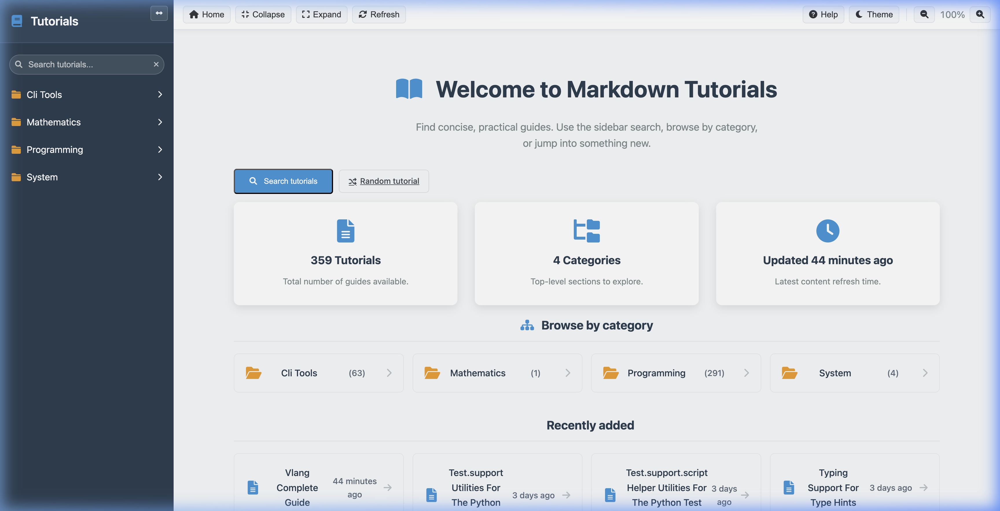
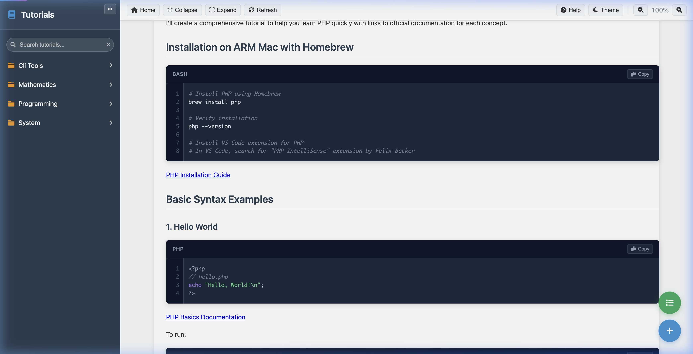
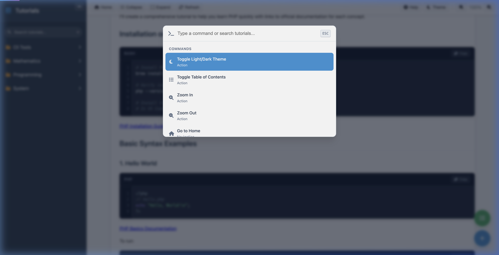

# Markdown Tutorials

A modern, feature-rich web application for browsing and viewing markdown-based tutorials with advanced search, bookmarking, progress tracking, and an exceptionally premium responsive design.

**Live Version**: [https://codefreelance.net/apps/markdown_tutorials/](https://codefreelance.net/apps/markdown_tutorials/)

---

## 🚀 Complete Capabilities & Features

### ⚡ Latest UI/UX Enhancements
- **SPA-style Page Transitions (AJAX)** - Smooth dynamic page loading with URL hash tracking and active sidebar states (zero full-page reloads).
- **Global Command Palette (`Cmd+K` / `Ctrl+K`)** - Fast keyboard-driven interface to search all tutorials, toggle theme, control zoom, and toggle outline view.
- **Code Blocks with Line Numbers** - Restructured code block wrapper featuring language tags, Copy button, and vertical line numbers aligned with code lines.
- **Floating Outline TOC** - A floating outline button and menu overlay appears in the bottom right when the main TOC is hidden.
- **Outline TOC Filtering** - Real-time filter search bar added to both the right-rail TOC panel and the floating outline popover for quick section lookups.
- **Heading Hover Anchor Links** - Hovering over headings in a tutorial displays a deep link icon (`🔗`). Click to copy a direct section link.
- **Scroll Progress Indicator** - A gradient progress bar fixed to the top of the viewport tracks reading completion.

### 🧭 Navigation & Discovery
- **Sidebar Fuzzy Search** - Real-time filtering with highlighted search matches, autocomplete suggestions, and search history.
- **Hierarchical Sidebar** - Expandable folder structure with visual state persistence (folders stay expanded/collapsed across visits).
- **Auto-expanding Folders** - Expanding parent folders automatically when viewing a direct tutorial URL.
- **Interactive Table of Contents (TOC)** - Right-rail sticky TOC with scrollspy active section highlighting. Toggles visibility and persists state.
- **"Previous" Scroll Button** - An automatic "Previous" button appears next to target headings when jumping via anchor links to return to your prior scroll position.
- **Dynamic Breadcrumbs** - Clicking paths in the breadcrumb path navigates instantly with responsive handling for nested paths.

### 🛠️ Interactive Toolbar Controls
- **Home Button** - Instant return to the homepage insights panel.
- **Sidebar Width Toggles** - Dynamically toggles between collapsed (icon only), normal, and expanded modes.
- **Collapse/Expand All** - Closes or opens all sidebar folders at once with a non-blocking busy spinner overlay.
- **Navigation Refresh** - Re-evaluates folder structures and re-renders current layouts.
- **Keyboard Shortcuts Dialog (F1)** - Shows all keyboard combinations in a modal dialog.
- **Theme Toggle** - Instantly switch between light and dark themes with visual transitions and saved state.
- **Zoom Controls** - Adjust article scale (80–180%) with a live zoom indicator, leaving the Table of Contents readable and fixed.

### 🔖 Bookmarks & Reading Progress
- **Bookmark System** - Bookmark tutorials to access them later. 
- **Reading Progress Tracker** - Tracks and displays your scroll position (percentage) for bookmarked tutorials.
- **Recent History** - Keeps a record of recently read pages with relative "time ago" timestamps on the homepage.

### 🎨 Design & Accessibility
- **Responsive Layout** - Optimizes viewport layouts with a slide-out drawer on mobile/tablet screens.
- **Accessibility (a11y) Focus** - Full focus indicators, keyboard support for modals, and semantic ARIA labeling.
- **Theme Accents** - Uses SVG icons and a custom `theme-color` meta tag to match browser header frames.
- **Print Optimization** - Standard CSS printing rules remove sidebars, headers, toolbars, and float buttons to print clean documentation pages.

---

## 🖼️ Screenshots

### 1. Homepage & Insights

*Homepage with dynamic statistics, category grids, search, and recently updated tutorials.*

### 2. Tutorial View & Code Layout

*Detailed tutorial view showing right-rail TOC, scroll progress indicator, heading anchor links, and code blocks with language labels and line numbers.*

### 3. Command Palette (`Cmd + K`)

*The global interactive Command Palette showing options to trigger actions or quickly jump to other tutorials.*

---

## ⌨️ Keyboard Shortcuts

| Shortcut | Action |
| --- | --- |
| `F1` | Show Keyboard Shortcuts Modal |
| `Cmd/Ctrl + K` | Open Command Palette |
| `Cmd/Ctrl + B` | Toggle Sidebar Width |
| `Cmd/Ctrl + D` | Toggle Bookmark |
| `Cmd/Ctrl + H` | Go to Homepage |
| `Cmd/Ctrl + P` | Print Tutorial |
| `+` / `=` | Zoom In |
| `-` | Zoom Out |
| `Esc` | Close Dialogs / Modals / Clear Search |

---

## 🛠️ Technology Stack

### Backend
- **PHP 7.4+** - Lightweight server-side routing and templates
- **Parsedown** - Server-side Markdown parsing library
- **Composer** - Package dependency manager

### Frontend
- **Vanilla CSS** - High-performance custom layout and styles
- **Marked.js** - Client-side Markdown parser
- **Highlight.js** - Syntax highlighting for 20+ languages
- **Font Awesome** - Modern vector iconography

---

## ⚙️ Installation & Setup

### Setup

1. **Clone the repository**:
   ```bash
   git clone https://github.com/codecaine-zz/markdown_tutorials.git
   cd markdown_tutorials
   ```

2. **Install composer dependencies**:
   ```bash
   composer install
   ```

3. **Start the local PHP server**:
   ```bash
   php -S localhost:8080
   ```

4. **Open in browser**:
   Navigate to `http://localhost:8080`

---

## 📂 Project Structure

```text
markdown_tutorials/
├── favicon.svg               # Tab favicon
├── index.php                 # Main application template & router
├── assets/
│   ├── css/
│   │   └── style.css         # Custom layout, themes, and UI elements
│   └── js/
│       └── app.js            # SPA logic, line numbers, command palette
├── screenshots/              # Documentation images
├── tutorials/                # Markdown content files (.md)
├── vendor/                   # Composer dependencies
└── README.md                 # This file
```

---

## 📝 License

This project is open-source and free to use, modify, and distribute. Feel free to contribute pull requests!
