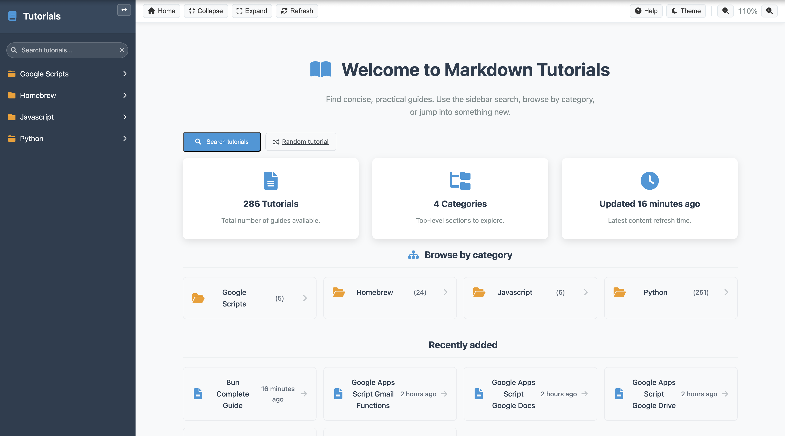
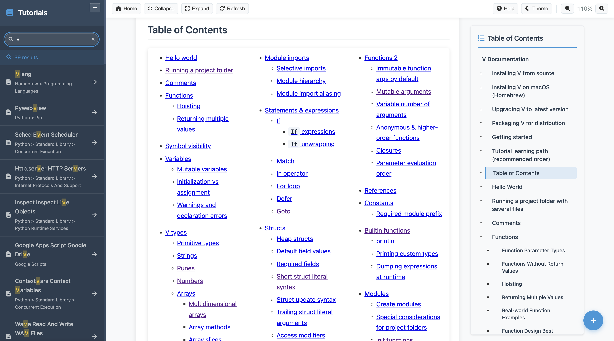

# Markdown Tutorials

A modern web application for browsing and viewing markdown-based tutorials with syntax highlighting, navigation, and responsive design.

## Features

- 📚 **Interactive Tutorial Browser** - Navigate through organized tutorial collections
- 🎨 **Syntax Highlighting** - Code blocks highlighted with Highlight.js for 20+ languages
- 📱 **Responsive Design** - Works seamlessly on desktop and mobile devices
- 📋 **Copy to Clipboard** - One-click copying for all code blocks
- 🧭 **Smart Navigation** - Breadcrumb navigation and expandable folder structure
- 🔍 **Search & Discovery** - Sidebar search with live filtering and auto-expanding results
- 🧩 **Toggleable Table of Contents** - Auto-generated ToC per tutorial with smooth anchor navigation
- 🧱 **Sidebar Width Toggle** - Expand/collapse the sidebar for focus or overview
- 🎯 **Smooth Scrolling** - In-page anchor navigation with smooth scrolling and target highlight
- 🧰 **Top Toolbar** - Home, Collapse/Expand All, Refresh, Theme, and Zoom controls
- 🌗 **Theme Toggle** - Light/Dark theme with instant switch and saved preference
- 🔎 **Zoom Controls** - 80–180% zoom with live indicator and persistence
- 💾 **Persistent UI State** - Remembers theme, zoom level, sidebar width, and folder open/closed states
- 🧮 **Homepage Insights** - Stats (total tutorials, categories, last updated), browse-by-category, and recently added list
- 🎲 **Random Tutorial** - Jump to a randomly selected guide from the homepage
- 🖼️ **SVG Favicon + Theme Color** - Crisp tab icon and browser UI color via `<link rel="icon">` and `meta theme-color`

## Screenshots

### Application Interface


*Main tutorial browser interface with navigation sidebar and content area*


*Detailed tutorial view with syntax highlighting and copy functionality*

## Tutorial Categories

### 📦 Homebrew

Comprehensive guides for macOS package management:

- **CLI Tools**: bat, curl, fd-find, gawk, grep, jq, sed, wget
- **Development Tools**: Docker, FFmpeg, Git, ImageMagick, Ollama, OpenSSL
- **Programming Languages**: V Language
- **Security Tools**: Metasploit, Nmap
- **System Guides**: Keyboard shortcuts, MacBook tips, Terminal usage

### 🐍 Python Standard Library

Complete documentation for Python's built-in modules organized by category:

- Binary Data Services
- Concurrent Execution
- Cryptographic Services
- Data Compression and Archiving
- File and Directory Access
- Internet Protocols and Support
- And many more...

### 📝 Google Apps Script

Tutorials for automating Google services:

- Gmail Functions
- Google Docs automation
- Google Drive operations
- Google Sheets manipulation
- YouTube API integration

## Technology Stack

### Backend

- **PHP 7.4+** - Server-side rendering and routing
- **Parsedown** - Markdown parsing library
- **Composer** - Dependency management

### Frontend

- **Pure CSS** - Custom responsive styling
- **Highlight.js** - Syntax highlighting for 20+ languages
- **Marked.js** - Client-side markdown processing
- **Font Awesome** - Icons and visual elements

### Supported Languages

- Python, Java, PHP, JavaScript
- Bash, SQL, JSON, YAML
- Docker, Go, Rust, Swift, Kotlin
- And many more...

## Installation

### Prerequisites

- PHP 7.4 or higher
- Composer (for dependency management)
- Web server (built-in PHP server works fine for development)

### Setup

1. **Clone the repository**:

   ```bash
   git clone <repository-url>
   cd markdown_tutorials
   ```

2. **Install dependencies**:

   ```bash
   composer install
   ```

3. **Start the development server**:

   ```bash
   php -S localhost:8080
   ```

4. **Open in browser**:
   Navigate to `http://localhost:8080`

## Usage

### Adding New Tutorials

1. Create markdown files (`.md`) in the `tutorials/` directory
2. Organize them in folders for better navigation
3. Use standard markdown syntax with front matter if needed
4. Code blocks will automatically get syntax highlighting and copy buttons

Example tutorial structure:

```text
tutorials/
├── category-name/
│   ├── tutorial-1.md
│   ├── tutorial-2.md
│   └── subcategory/
│       └── advanced-tutorial.md
```

### Markdown Format

Tutorials support standard markdown with enhancements:

````markdown
# Tutorial Title

## Section Header

Regular text content with **bold** and *italic* formatting.

### Code Examples

```python
def hello_world():
    print("Hello, World!")
    return True
```

- Lists work normally
- With nested items
  - Like this

> Blockquotes for important notes
````

## Project Structure

```text
markdown_tutorials/
├── favicon.svg              # SVG site favicon
├── index.php                 # Main application entry point
├── assets/
│   ├── css/
│   │   └── style.css         # All application styles
│   └── js/
│       └── app.js            # Frontend functionality
├── logs/                     # Application logs
├── screenshots/              # Documentation images
├── tutorials/                # Tutorial content
│   ├── homebrew/            # Homebrew package guides
│   ├── python/              # Python documentation
│   └── google scripts/      # Google Apps Script tutorials
├── vendor/                   # Composer dependencies
│   └── parsedown/           # Markdown parser
└── README.md                # This file
```

## Homepage Overview

The homepage now helps you get to content faster:

- Stats summary: total tutorials, total categories, and the time since the latest update
- Quick actions: focus the sidebar search and open a random tutorial
- Browse by category: top-level folders with tutorial counts
- Recently added: most recently updated tutorials with “time ago” labels

These sections are generated dynamically from the `tutorials/` directory.

## Key Features Explained

### Navigation System

- **Hierarchical browsing** with expandable folders
- **Breadcrumb navigation** shows current location
- **Mobile-responsive** sidebar with hamburger toggle
- **Smart expansion** - folders open automatically when viewing contained files

### UI Enhancements

- **Sidebar Width Toggle**
   - Click the chevron button in the sidebar to expand/collapse it.
   - The main content shifts to accommodate the chosen width.

- **Sidebar Search (Live Filter)**
   - Type in the sidebar search box to filter tutorials by name.
   - Matching items remain visible and parent folders auto-expand for quick access.
   - Clear the query with the “×” button.

- **Toggleable Table of Contents**
   - On any tutorial page, click “Contents” to show/hide the ToC.
   - The ToC is generated from headings and supports smooth scrolling.
   - Target headings briefly highlight; a small inline “Previous” button returns to your prior scroll position.

- **Enhanced Anchor Navigation**
   - Stable, GitHub-like heading IDs, smooth in-page links, and automatic link rewrites for reliable anchors.

- **Improved Code Copy UX**
   - Always-visible copy buttons on code blocks (mobile friendly), with success/failure feedback and clipboard fallback.

- **Top Toolbar**
   - Quick actions: Home, Collapse All, Expand All, Refresh.
   - Theme toggle (sun/moon) and Zoom controls with a live percentage indicator.

- **Theme & Zoom Persistence**
   - Theme and zoom preferences are saved automatically and restored on page load.
   - Zoom range: 80–180% for comfortable reading.

- **Bulk Sidebar Actions & Busy Overlay**
   - Collapse/Expand All folders with a brief, non-blocking spinner overlay.
   - Keeps the UI responsive during batch updates.

- **Persistent Navigation State**
   - Remembers sidebar width state (normal/expanded/collapsed).
   - Restores open/closed states of folders across visits.

- **Keyboard Shortcuts**
   - F1: Show shortcut help
   - Cmd/Ctrl+F: Focus sidebar search
   - Cmd/Ctrl+B: Toggle sidebar width
   - Cmd/Ctrl+H: Home
   - Plus/Minus: Zoom in/out

### What’s New

Latest updates:

- New homepage insights panel with quick actions (focus search, random tutorial), stats, browse-by-category, and recently added tutorials
- Added SVG favicon (`favicon.svg`) and `theme-color` for better browser tab and mobile UI integration

Previously shipped:

- Top toolbar, dark/light theme toggle, zoom controls with live indicator
- Batch expand/collapse for the sidebar and persistent UI state (theme, zoom, sidebar width, folder states)

### Syntax Highlighting

- Powered by **Highlight.js 11.9.0**
- Supports **20+ programming languages**
- **GitHub Dark theme** for consistent appearance
- **Automatic language detection**

### Copy Functionality

- **One-click copying** for all code blocks
- **Visual feedback** with success/error states
- **Preserves formatting** and indentation

### Responsive Design

- **Mobile-first approach**
- **Collapsible sidebar** on small screens
- **Touch-friendly** navigation elements
- **Readable typography** across all devices

## Favicon and Theme Color

- Favicon lives at the repo root as `favicon.svg`
- Included via:
  - `<link rel="icon" type="image/svg+xml" href="/favicon.svg">`
  - `<meta name="theme-color" content="#0f172a">`

Modern browsers will show the SVG in the tab bar and use the theme color for UI accents (especially on mobile).

## Development

### File Organization

- **Single-file application** (`index.php`) for simplicity
- **Separation of concerns** with dedicated CSS and JS files
- **Class-based architecture** with clean method separation
- **Error handling** with logging to `logs/` directory

### Adding Language Support

To add syntax highlighting for additional languages:

1. Add the language script in `index.php`:

   ```php
   <script src="https://cdnjs.cloudflare.com/ajax/libs/highlight.js/11.9.0/languages/language-name.min.js"></script>
   ```

2. The highlighting will work automatically in code blocks:

   ````markdown
   ```language-name
   // Your code here
   ```
   ````

## Troubleshooting

### Common Issues

**Server not starting:**

- Ensure you're running from the project root directory
- Check PHP version: `php --version`
- Try a different port: `php -S localhost:3000`

**Tutorials not loading:**

- Check file permissions on `tutorials/` directory
- Verify markdown files have `.md` extension
- Check browser console for JavaScript errors

**Styling issues:**

- Clear browser cache
- Check that `assets/` directory is accessible
- Verify CSS file loads in browser developer tools

## License

This project is open source. Feel free to use, modify, and distribute according to your needs.

## Contributing

1. Fork the repository
2. Create a feature branch
3. Make your changes
4. Test thoroughly
5. Submit a pull request

## Support

For issues or questions:

- Check the browser console for JavaScript errors
- Review PHP error logs in `logs/php_errors.log`
- Verify file permissions and server configuration
