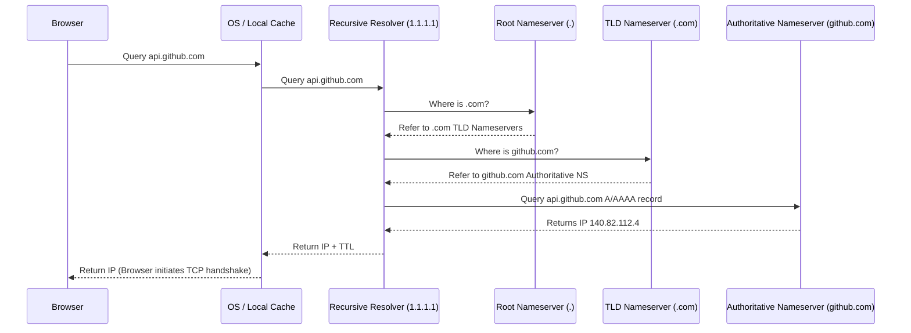
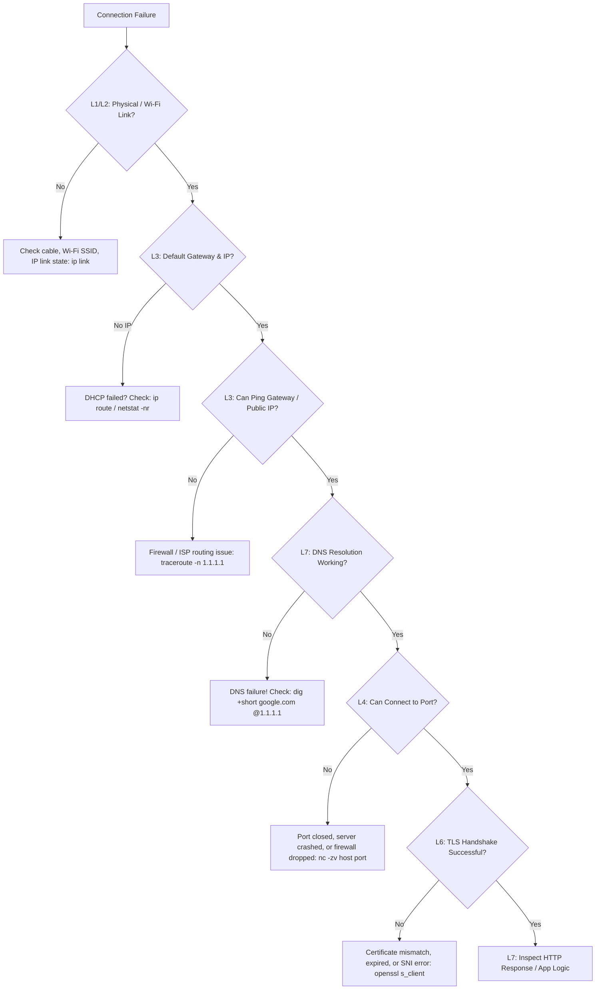

# Computer Networking Fundamentals for Software Developers

A rigorous understanding of computer networking-from packet encapsulation through TCP flow control and TLS 1.3 cryptographic handshakes-is essential for diagnosing network latency, architecting distributed systems, and securing APIs.

---

## 📚 Table of Contents

1. [The Layered Network Models: OSI vs. TCP/IP](#1-the-layered-network-models-osi-vs-tcpip)
2. [Packet Encapsulation & Decapsulation](#2-packet-encapsulation--decapsulation)
3. [Layer 3 (Network): IPv4, IPv6 & CIDR Subnetting Math](#3-layer-3-network-ipv4-ipv6--cidr-subnetting-math)
4. [Layer 4 (Transport): TCP Deep Dive](#4-layer-4-transport-tcp-deep-dive)
   - [TCP 3-Way Handshake & 4-Way Teardown](#tcp-3-way-handshake--4-way-teardown)
   - [Flow Control vs. Congestion Control](#flow-control-vs-congestion-control)
5. [UDP & The Shift to QUIC (HTTP/3)](#5-udp--the-shift-to-quic-http3)
6. [The DNS Resolution Journey](#6-the-dns-resolution-journey)
7. [TLS 1.3 Cryptographic Handshake](#7-tls-13-cryptographic-handshake)
8. [Evolution of Web Protocols: HTTP/1.1 vs. HTTP/2 vs. HTTP/3](#8-evolution-of-web-protocols-http11-vs-http2-vs-http3)
9. [Developer Switchblade: Common Port Numbers Matrix](#9-developer-switchblade-common-port-numbers-matrix)
10. [Reserved IP Address Blocks (RFC 1918 & Special Ranges)](#10-reserved-ip-address-blocks-rfc-1918--special-ranges)
11. [DNS Record Types & Inspection Cheat Sheet](#11-dns-record-types--inspection-cheat-sheet)
12. [Essential HTTP Headers & CORS Reference](#12-essential-http-headers--cors-reference)
13. [Network Diagnostics & Switchblade CLI One-Liners](#13-network-diagnostics--switchblade-cli-one-liners)
14. [Network Troubleshooting Playbook (L1 to L7)](#14-network-troubleshooting-playbook-l1-to-l7)

---

## 1. The Layered Network Models: OSI vs. TCP/IP

The network stack partitions responsibilities into modular layers:

```text
OSI 7-Layer Model                     TCP/IP 4-Layer Model       Common Protocols
┌─────────────────────────┐
│ 7. Application          │ ───┐
├─────────────────────────┤    ├─► Application Layer     HTTP, DNS, SSH, gRPC, TLS
│ 6. Presentation         │ ───┤
├─────────────────────────┤    │
│ 5. Session              │ ───┘
├─────────────────────────┤
│ 4. Transport            │ ─────► Transport Layer       TCP, UDP, QUIC
├─────────────────────────┤
│ 3. Network              │ ─────► Internet Layer        IPv4, IPv6, ICMP, BGP
├─────────────────────────┤
│ 2. Data Link            │ ───┐
├─────────────────────────┤    ├─► Network Access Layer  Ethernet, Wi-Fi, ARP
│ 1. Physical             │ ───┘
└─────────────────────────┘
```

---

## 2. Packet Encapsulation & Decapsulation

When data travels down the stack, each layer wraps the payload with its own protocol header:

```text
[ Data / Payload ]                                       (Application Layer)
[ TCP Header | Data ]                                    (Segment)
[ IP Header | TCP Header | Data ]                        (Packet)
[ Ethernet Frame Header | IP Header | TCP Header | Data | Frame Check Sequence ] (Frame)
```

At the receiving host, **decapsulation** strips each header in reverse order until the raw payload reaches the application process.

---

## 3. Layer 3 (Network): IPv4, IPv6 & CIDR Subnetting Math

### CIDR (Classless Inter-Domain Routing) Notation

An IPv4 address consists of 32 bits divided into 4 octets. A prefix length (e.g. `/24`) specifies how many bits represent the **Network Prefix**, leaving the remaining bits for **Host Addresses**.

| CIDR Prefix | Subnet Mask | Available Usable Hosts ($2^{32-\text{prefix}} - 2$) | Typical Use |
| :--- | :--- | :--- | :--- |
| `/32` | `255.255.255.255` | 1 (Single Host) | Point-to-point route |
| `/28` | `255.255.255.240` | 14 hosts | Small VPC public subnet |
| `/24` | `255.255.255.0` | 254 hosts | Standard home LAN / office subnet |
| `/16` | `255.255.0.0` | 65,534 hosts | Entire AWS/GCP VPC |

> [!NOTE]
> Two addresses are reserved in every subnet: the **Network Address** (all host bits 0) and the **Broadcast Address** (all host bits 1).

---

## 4. Layer 4 (Transport): TCP Deep Dive

TCP provides reliable, ordered, error-checked delivery of byte streams between hosts.

### TCP 3-Way Handshake (Establishing Connection)

```text
Client                                  Server
  │                                       │
  │ ─── SYN (Seq = X) ─────────────────►  │  (Client requests connection)
  │                                       │
  │ ◄── SYN-ACK (Seq = Y, Ack = X + 1) ── │  (Server acknowledges & syncs)
  │                                       │
  │ ─── ACK (Seq = X + 1, Ack = Y + 1) ─► │  (Client confirms: ESTABLISHED)
  ▼                                       ▼
```

### TCP 4-Way Teardown (Terminating Connection)

```text
Client                                  Server
  │                                       │
  │ ─── FIN ────────────────────────────► │  (Client: "I have no more data to send")
  │ ◄── ACK ───────────────────────────── │  (Server acknowledges FIN)
  │                                       │
  │ ◄── FIN ───────────────────────────── │  (Server: "I am also finished")
  │ ─── ACK ────────────────────────────► │  (Client acknowledges FIN)
  ▼                                       ▼
```

### Flow Control vs. Congestion Control

- **Flow Control (End-to-End)**: Prevents the sender from overwhelming the receiver's buffer using the **Sliding Window (`TCP Win`)** advertised in packet headers.
- **Congestion Control (Network-Wide)**: Prevents the sender from overwhelming intermediate network routers. Employs algorithms like **Slow Start**, **AIMD** (Additive Increase Multiplicative Decrease), and modern **BBR** (Bottleneck Bandwidth and RTT).

---

## 5. UDP & The Shift to QUIC (HTTP/3)

UDP is connectionless, unordered, and lightweight: zero handshakes, no acknowledgments, no head-of-line blocking.

Historically reserved for DNS and real-time audio/video, modern web transport has transitioned to **QUIC**-a reliable transport protocol built on top of UDP that replaces TCP for HTTP/3.

---

## 6. The DNS Resolution Journey

When requesting `https://api.github.com`, your system traverses a hierarchical distributed database:



---

## 7. TLS 1.3 Cryptographic Handshake

TLS 1.3 reduces cryptographic latency to a **single round-trip (1-RTT)** while eliminating insecure legacy ciphers (RSA key exchange, CBC modes):

```text
Client                                  Server
  │                                       │
  │ ─── Client Hello ───────────────────► │  Supported ciphers + Diffie-Hellman Key Share
  │                                       │
  │ ◄── Server Hello + Cert + Handshake ─ │  Server DH Share + Signed Certificate + MAC
  │                                       │
  │     [ Both derive symmetric AES-GCM / ChaCha20 encryption keys independently ]
  │                                       │
  │ ─── Encrypted Application Data ─────► │  (HTTP GET / REST requests)
  ▼                                       ▼
```

---

## 8. Evolution of Web Protocols: HTTP/1.1 vs. HTTP/2 vs. HTTP/3

| Metric | HTTP/1.1 (1997) | HTTP/2 (2015) | HTTP/3 (2022) |
| :--- | :--- | :--- | :--- |
| **Transport** | TCP | TCP | UDP (QUIC) |
| **Multiplexing** | No (1 request per TCP socket) | Yes (Multiple streams over 1 TCP connection) | Yes (Independent streams over QUIC) |
| **Head-of-Line Blocking**| Application layer HoL blocking | Transport layer HoL blocking (1 lost packet stalls all streams) | **Eliminated** (packet loss affects only 1 stream) |
| **Header Compression** | None (Plaintext repetitive headers) | HPACK | QPACK |
| **Handshake Latency** | 1 RTT (TCP) + 1-2 RTT (TLS) | 1 RTT (TCP) + 1 RTT (TLS 1.3) | **0-1 RTT** (Combined transport + crypto) |

---

## 9. Developer Switchblade: Common Port Numbers Matrix

A quick-reference lookup for standard network services, datastores, dev servers, and infrastructure:

| Port | Protocol / Service | Default Usage |
| :--- | :--- | :--- |
| **21** | FTP | File Transfer Protocol (Control) |
| **22** | SSH / SFTP | Secure Shell & Git over SSH |
| **25** | SMTP | Simple Mail Transfer Protocol (Insecure relay) |
| **53** | DNS | Domain Name System (UDP/TCP) |
| **80** | HTTP | Plaintext Web Traffic |
| **123** | NTP | Network Time Protocol (UDP clock sync) |
| **443** | HTTPS | Encrypted Web Traffic & HTTP/2 |
| **465 / 587** | SMTPS / Submission | Secure Mail Submission (TLS/STARTTLS) |
| **993** | IMAPS | Encrypted Email Retrieval |
| **1433** | MSSQL | Microsoft SQL Server |
| **3000** | Dev Server | React, Next.js, Node.js, Grafana |
| **3306** | MySQL / MariaDB | Relational Database |
| **5432** | PostgreSQL | Relational Database |
| **6379** | Redis | In-Memory Key-Value & Cache |
| **8000 / 8080** | HTTP Alternate | FastAPI, Django, Spring Boot, Nginx proxy |
| **8443** | HTTPS Alternate | Alternative SSL/TLS web services |
| **9090** | Prometheus | Metrics Scraper & Cockpit UI |
| **9200 / 9300** | Elasticsearch | REST API & Cluster Inter-Node |
| **27017** | MongoDB | Document Database |
| **51820** | WireGuard | Modern VPN Tunneling (UDP) |

---

## 10. Reserved IP Address Blocks (RFC 1918 & Special Ranges)

Never route private or reserved address blocks to the public internet:

| Address Block | Prefix | Scope / RFC | Purpose |
| :--- | :--- | :--- | :--- |
| `10.0.0.0` – `10.255.255.255` | `10.0.0.0/8` | Private (RFC 1918) | Enterprise LANs, Cloud VPCs (AWS, GCP) |
| `172.16.0.0` – `172.31.255.255`| `172.16.0.0/12` | Private (RFC 1918) | Docker default bridge (`172.17.0.0/16`), LANs |
| `192.168.0.0` – `192.168.255.255`| `192.168.0.0/16`| Private (RFC 1918) | Home Wi-Fi routers, local office LANs |
| `127.0.0.0` – `127.255.255.255`| `127.0.0.0/8` | Loopback (RFC 1122) | Localhost (`127.0.0.1`) inter-process IPC |
| `169.254.0.0` – `169.254.255.255`| `169.254.0.0/16`| Link-Local (RFC 3927) | APIPA (auto-assigned when DHCP fails), AWS IMDS (`169.254.169.254`) |
| `100.64.0.0` – `100.127.255.255`| `100.64.0.0/10` | CGNAT (RFC 6598) | Carrier-Grade NAT, Tailscale mesh IP addressing |
| `224.0.0.0` – `239.255.255.255`| `224.0.0.0/4` | Multicast (RFC 5771) | mDNS (`224.0.0.251`), streaming protocols |
| `::1/128` | `/128` | IPv6 Loopback | Localhost in IPv6 |
| `fe80::/10` | `/10` | IPv6 Link-Local | Local link communication without router |

---

## 11. DNS Record Types & Inspection Cheat Sheet

DNS is more than domain-to-IP lookup; it manages email verification, routing, and TLS security:

| Record Type | Purpose | Example Value |
| :--- | :--- | :--- |
| **A** | Maps hostname to IPv4 address | `api.example.com -> 93.184.216.34` |
| **AAAA** | Maps hostname to 128-bit IPv6 address | `api.example.com -> 2606:2800:220:1:248:1893:25c8:1946` |
| **CNAME** | Canonical name alias (points to another domain) | `www.example.com -> example.com` |
| **MX** | Mail Exchanger (includes priority ranking) | `10 mail.protonmail.ch` |
| **TXT** | Arbitrary text (Used for SPF, DKIM, DMARC, site verify) | `"v=spf1 include:_spf.google.com ~all"` |
| **NS** | Authoritative Nameserver delegation | `ns1.cloudflare.com` |
| **PTR** | Reverse DNS (IP address back to hostname) | `34.216.184.93.in-addr.arpa -> example.com` |
| **SRV** | Service discovery (Port, Weight, Priority) | `_sip._tcp.example.com -> 10 60 5060 bigbox.com` |
| **CAA** | Certificate Authority Authorization (restricts who issues SSL) | `0 issue "letsencrypt.org"` |

### CLI DNS Inspection Recipes

```bash
# Query all records cleanly using dig
dig +noall +answer example.com ANY

# Trace authoritative delegation chain from root (.) down to domain
dig +trace example.com

# Reverse IP lookup
dig -x 1.1.1.1 +short

# Verify DKIM TXT record
dig +short TXT default._domainkey.example.com
```

---

## 12. Essential HTTP Headers & CORS Reference

### Security & Protocol Headers

- **`Strict-Transport-Security` (HSTS)**: `max-age=31536000; includeSubDomains; preload`
  Enforces HTTPS only; prevents SSL stripping attacks.
- **`Content-Security-Policy` (CSP)**: `default-src 'self'; script-src 'self' https://trusted.cdn.com`
  Prevents Cross-Site Scripting (XSS) and arbitrary script injection.
- **`Cache-Control`**: `no-store` (never cache), or `public, max-age=31536000, immutable` (long-term static asset caching).

### Cross-Origin Resource Sharing (CORS) Flow

When a browser script at `https://frontend.dev` fetches data from `https://api.backend.dev`, the browser executes a **Preflight Request**:

```http
OPTIONS /api/v1/users HTTP/1.1
Host: api.backend.dev
Origin: https://frontend.dev
Access-Control-Request-Method: POST
Access-Control-Request-Headers: Authorization, Content-Type

--- Server Preflight Response ---
HTTP/1.1 204 No Content
Access-Control-Allow-Origin: https://frontend.dev
Access-Control-Allow-Methods: GET, POST, OPTIONS
Access-Control-Allow-Headers: Authorization, Content-Type
Access-Control-Max-Age: 86400
```

---

## 13. Network Diagnostics & Switchblade CLI One-Liners

Every developer should have these commands committed to muscle memory:

### 1. Check Active Listening Ports & Processes

```bash
# macOS: Find process holding port 8080
lsof -nP -iTCP:8080 -sTCP:LISTEN

# Linux: Modern socket inspection with PID
sudo ss -tulpn | grep :8080
```

### 2. Path MTU Discovery (Locate Packet Fragmentation Issues)

If VPNs or cloud networks drop packets due to MTU size:

```bash
# macOS: Ping with 'Don't Fragment' flag (-D) and custom payload size (-s)
# 1472 bytes payload + 28 bytes header (20 IP + 8 ICMP) = 1500 bytes MTU
ping -D -s 1472 1.1.1.1

# Linux equivalent:
ping -M do -s 1472 1.1.1.1
```

### 3. Test Remote TCP Port Reachability Without Telnet

```bash
# Fast zero-IO port probe using Netcat
nc -zv api.github.com 443

# Using Bash native pseudo-device (no tools required!)
(echo > /dev/tcp/api.github.com/443) >/dev/null 2>&1 && echo "Port Open" || echo "Port Closed"
```

### 4. Deep Latency Profiling with cURL

Create a format template `curl-timing.txt`:

```text
    DNS Lookup Time:   %{time_namelookup} s\n
    TCP Connect Time: %{time_connect} s\n
    TLS Handshake Time:%{time_appconnect} s\n
    Pre-transfer Time: %{time_pretransfer} s\n
    Time to First Byte:%{time_starttransfer} s\n
    ---------------------------------------\n
    Total Request Time:%{time_total} s\n
```

Profile any API endpoint with microsecond breakdown:

```bash
curl -w "@curl-timing.txt" -o /dev/null -s https://api.github.com
```

### 5. Inspect TLS Certificate Expiry from CLI

```bash
echo | openssl s_client -servername example.com -connect example.com:443 2>/dev/null | openssl x509 -noout -dates -subject
```

---

## 14. Network Troubleshooting Playbook (L1 to L7)

When you encounter the dreaded *"Cannot connect to host"* error, follow the systematic OSI bottom-up diagnostic workflow:



1. **Layer 1 & 2 (Link)**: Is the network interface up? `ip link` or macOS `networksetup -listallhardwareports`.
2. **Layer 3 (IP & Routing)**: Did DHCP assign an IP? Can you reach the local router gateway? `ping $(ip route | awk '/default/ {print $3}')`.
3. **Layer 4 (Transport / Firewall)**: Is the port accepting packets? `nc -zv host port` or `telnet host port`. If it hangs, an upstream firewall or security group dropped the SYN packet.
4. **Layer 6 (TLS / SSL)**: Is there a certificate mismatch, expired cert, or SNI SNI failure? Verify with `openssl s_client`.
5. **Layer 7 (Application)**: Is the service returning HTTP 502/503/504? Check reverse proxy configs (Nginx/Traefik) and application server logs.

