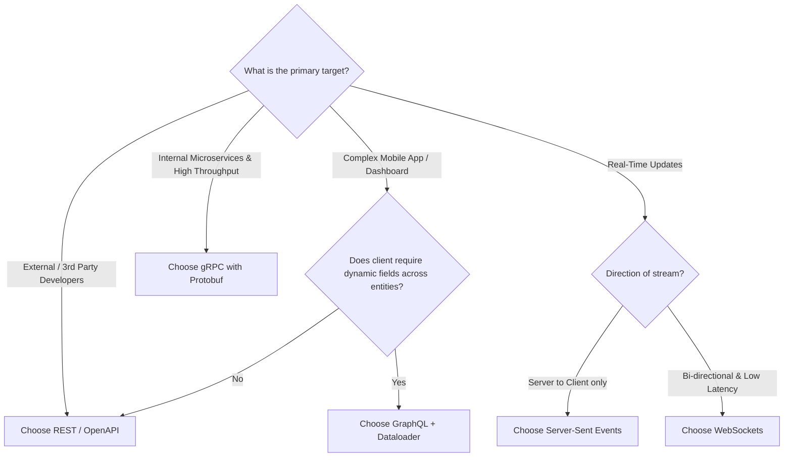

# API Architecture Paradigms: REST, GraphQL, gRPC & WebSockets

Modern distributed applications require selecting the right communication paradigm for the right network boundary. Choosing between **REST**, **GraphQL**, **gRPC**, and **WebSockets** dictates network payload overhead, type safety, latency, and client-developer ergonomics.

---

## 📚 Table of Contents

1. [Architectural Comparison Matrix](#1-architectural-comparison-matrix)
2. [REST: Resource-Oriented Web APIs](#2-rest-resource-oriented-web-apis)
3. [GraphQL: Client-Driven Declarative Data Fetching](#3-graphql-client-driven-declarative-data-fetching)
4. [gRPC: High-Performance Binary Microservice RPCs](#4-grpc-high-performance-binary-microservice-rpcs)
5. [WebSockets & Server-Sent Events (SSE): Real-Time Streaming](#5-websockets--server-sent-events-sse-real-time-streaming)
6. [Architectural Decision Guide: What to Use When](#6-architectural-decision-guide-what-to-use-when)

---

## 1. Architectural Comparison Matrix

| Feature | REST | GraphQL | gRPC | WebSockets |
| :--- | :--- | :--- | :--- | :--- |
| **Transport** | HTTP/1.1 or HTTP/2 | Typically HTTP/1.1 or HTTP/2 | HTTP/2 (Mandatory) | TCP Upgrade |
| **Payload Format** | JSON / XML (Text) | JSON (Text) | Protocol Buffers (Binary) | Text or Binary |
| **Schema Contract** | OpenAPI / Swagger | GraphQL Schema (SDL) | `.proto` Definitions | Custom App Protocol |
| **Over/Under Fetching** | Frequent | Completely eliminated | Eliminated via fields | N/A |
| **Streaming Support** | SSE (Server only) | Subscriptions | Unary, Server, Client, Bi-di | Full Duplex Bi-di |
| **Browser Support** | Universal | Universal | Requires gRPC-Web proxy | Universal |
| **Primary Domain** | Public Web APIs | Mobile Apps & Dashboards | Internal Microservices | Real-Time Chat & Feeds |

---

## 2. REST: Resource-Oriented Web APIs

REST models systems as collections of **resources** accessed via standard HTTP methods.

### Standard HTTP Verbs & Semantics

| Method | Idempotent? | Safe? | Typical Semantics |
| :--- | :--- | :--- | :--- |
| `GET` | **Yes** | **Yes** | Retrieve resource representation without side effects |
| `POST` | No | No | Create new subordinate resource or trigger non-idempotent action |
| `PUT` | **Yes** | No | Replace resource representation completely |
| `PATCH`| No | No | Apply partial modifications to an existing resource |
| `DELETE`| **Yes** | No | Remove resource |

### Idiomatic Status Codes

- `200 OK`: Request succeeded with payload.
- `201 Created`: Resource successfully created (include `Location: /api/v1/items/42` header).
- `204 No Content`: Action completed successfully with no response body.
- `400 Bad Request`: Validation failure or malformed JSON.
- `401 Unauthorized`: Missing or invalid authentication token.
- `403 Forbidden`: Authenticated, but lacks authorization permissions.
- `404 Not Found`: Resource does not exist.
- `409 Conflict`: Duplicate entry or concurrent optimistic locking conflict.
- `422 Unprocessable Entity`: Semantic validation error.
- `429 Too Many Requests`: Rate limit exceeded.

### Caching with `ETag` & Conditional Headers

```http
GET /api/v1/users/42 HTTP/1.1
Host: api.example.com

HTTP/1.1 200 OK
ETag: "w/33a64df551425fcc"
Cache-Control: max-age=3600, must-revalidate

--- Subsequent Request ---
GET /api/v1/users/42 HTTP/1.1
If-None-Match: "w/33a64df551425fcc"

HTTP/1.1 304 Not Modified
(Zero payload transferred over wire!)
```

---

## 3. GraphQL: Client-Driven Declarative Data Fetching

GraphQL replaces multiple round-trips with a single endpoint (`POST /graphql`) where clients request exact field trees.

### Schema Definition Language (SDL)

```graphql
type Author {
  id: ID!
  name: String!
  posts: [Post!]!
}

type Post {
  id: ID!
  title: String!
  publishedAt: String
  author: Author!
}

type Query {
  post(id: ID!): Post
  feed(limit: Int = 10): [Post!]!
}
```

### Client Query Example

```graphql
query GetPostDetails {
  post(id: "101") {
    title
    author {
      name
    }
  }
}
```

### The N+1 Problem & Solution

In GraphQL, resolvers execute hierarchically. Fetching 50 posts and their authors naively fires 1 query for posts and 50 separate SQL queries for authors ($1 + N$).

**Solution**: Use a **DataLoader** batching utility to coalesce all author IDs into a single SQL statement:
`SELECT * FROM authors WHERE id IN (1, 2, 3...);`

---

## 4. gRPC: High-Performance Binary Microservice RPCs

gRPC uses Protocol Buffers to serialize structured data into compact binary wire representations. It leverages HTTP/2 multiplexing, header compression (HPACK), and strict type code generation across multiple languages.

### Define Protocol Buffer Contract (`user_service.proto`)

```protobuf
syntax = "proto3";

package users;

service UserService {
  rpc GetUser (UserRequest) returns (UserResponse);
  rpc StreamAuditLogs (LogRequest) returns (stream LogEntry);
}

message UserRequest {
  string user_id = 1;
}

message UserResponse {
  string user_id = 1;
  string email = 2;
  bool is_verified = 3;
}

message LogRequest {
  string service_name = 1;
}

message LogEntry {
  int64 timestamp = 1;
  string message = 2;
}
```

### Compiling Protobufs to Code

```bash
# Generate Go code
protoc --go_out=. --go-grpc_out=. user_service.proto

# Generate Python code
python -m grpc_tools.protoc -I. --python_out=. --grpc_python_out=. user_service.proto
```

---

## 5. WebSockets & Server-Sent Events (SSE): Real-Time Streaming

| Capability | Server-Sent Events (SSE) | WebSockets |
| :--- | :--- | :--- |
| **Direction** | Unidirectional (Server $\rightarrow$ Client) | Full Duplex (Server $\longleftrightarrow$ Client) |
| **Protocol** | Standard HTTP/1.1 or HTTP/2 | Custom WS/WSS protocol over TCP |
| **Reconnection** | Built-in browser auto-reconnect & last-event-id | Manual application-level reconnect logic |
| **Firewall / Proxy** | Traverses standard HTTP proxies seamlessly | Often blocked by strict corporate proxies |
| **Best For** | Stock prices, LLM token streaming, notifications | Multi-player games, live chat, collaborative editing |

### SSE Stream Example (Ideal for LLM Chat Completions)

```http
HTTP/1.1 200 OK
Content-Type: text/event-stream
Cache-Control: no-cache
Connection: keep-alive

data: {"token": "Hello"}

data: {"token": " world!"}

event: done
data: [DONE]
```

---

## 6. Architectural Decision Guide: What to Use When



- **Choose REST** for public developer platforms where caching, standard HTTP tools (`curl`, Postman), and universal firewall traversal are required.
- **Choose gRPC** for East-West backend microservice traffic where high throughput, low CPU serialization overhead, and strict type contracts matter.
- **Choose GraphQL** for frontend aggregating layers (BFF - Backend For Frontend) serving iOS/Android apps with varying screen density requirements.
- **Choose WebSockets** when true bi-directional messaging is required (e.g. whiteboard syncing, chat rooms).
