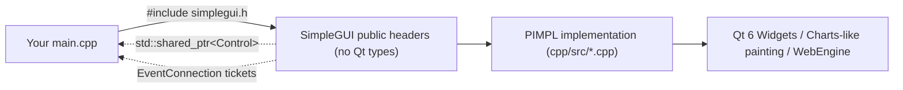

# EasyQt6 (SimpleGUI) — Zero-Boilerplate Qt 6 GUIs in C++ — Complete Guide

A complete, practical guide to **EasyQt6** (`codecaine-zz/easy_qt6`), a lightweight C++17 wrapper around **Qt 6 Widgets** that makes desktop GUI programming feel like **Visual Basic, Delphi, Lazarus or vlang_simplegui**. You build cross-platform apps (macOS, Linux, Windows x64 and Windows ARM64) without `Q_OBJECT`, without `moc`, without subclassing `QMainWindow`, and without ever including a Qt header in your own code.

> [!NOTE]
> **Who is this for?** Beginners who want windows and buttons with a handful of lines, C++ developers who want Qt's power without its ceremony, and RAD veterans (Delphi / Lazarus / VB / V) who want familiar names like `Edit`, `Memo`, `CheckBox`, `TrackBar` and `StringGrid`.

> [!TIP]
> Everything in the library lives in the `simplegui` namespace and is exposed through **one header**: `#include "simplegui/simplegui.h"`.

---

## 📑 Table of Contents

- [1. Overview & Philosophy](#1-overview-philosophy)
  - [Feature Highlights](#feature-highlights)
  - [Architecture: PIMPL + shared_ptr + EventConnection](#architecture-pimpl-shared_ptr-eventconnection)
  - [Screenshots](#screenshots)
- [2. Installing & Building](#2-installing-building)
  - [Prerequisites per Platform](#prerequisites-per-platform)
  - [Build the Library, Examples & Tests](#build-the-library-examples-tests)
  - [Adding Your Own Program](#adding-your-own-program)
- [3. Your First Program, Line by Line](#3-your-first-program-line-by-line)
- [4. The Five Core Ideas](#4-the-five-core-ideas)
- [5. Just Enough C++ for SimpleGUI](#5-just-enough-c-for-simplegui)
- [6. Coming from Delphi, Lazarus, VB or V](#6-coming-from-delphi-lazarus-vb-or-v)
- [7. Application & Themes](#7-application-themes)
- [8. Window: Menus, Status Bar & Closing](#8-window-menus-status-bar-closing)
- [9. Common Control API](#9-common-control-api)
- [10. Events & EventConnection](#10-events-eventconnection)
- [11. Naming Controls & find&lt;T&gt;()](#11-naming-controls-findt)
- [12. Layouts](#12-layouts)
- [13. Text & Buttons](#13-text-buttons)
- [14. Choices](#14-choices)
- [15. Numbers, Dates & Colors](#15-numbers-dates-colors)
- [16. Progress & Status](#16-progress-status)
- [17. Futuristic Controls](#17-futuristic-controls)
- [18. Pictures, Drawing & Tables](#18-pictures-drawing-tables)
- [19. Charts & Telemetry](#19-charts-telemetry)
- [20. Dashboard & App Widgets](#20-dashboard-app-widgets)
- [21. Web Pages, PDFs & Maps](#21-web-pages-pdfs-maps)
- [22. Dialogs](#22-dialogs)
- [23. Timer & run_later](#23-timer-run_later)
- [24. Familiar Names (Aliases)](#24-familiar-names-aliases)
- [25. Styling with Qt Style Sheets](#25-styling-with-qt-style-sheets)
- [26. Safety Built In](#26-safety-built-in)
- [27. Full Example: Classic RAD Contact Book](#27-full-example-classic-rad-contact-book)
- [28. Full Example: Futuristic Mission Control](#28-full-example-futuristic-mission-control)
- [29. Bundled Example Programs](#29-bundled-example-programs)
- [30. Troubleshooting & FAQ](#30-troubleshooting-faq)
- [31. Advanced: Mixing in Raw Qt](#31-advanced-mixing-in-raw-qt)
- [Summary & Links](#summary-links)

---

## 1. Overview & Philosophy

EasyQt6 (the library and namespace are called **SimpleGUI**) uses Qt 6 under the hood — a professional toolkit used by thousands of companies — but you never have to learn Qt. The pattern for **every** program is:

```
create Application → create Window → create controls → arrange in a layout → react to events → show → run
```

### Feature Highlights

| Feature | What you get |
|---|---|
| **No boilerplate** | No `Q_OBJECT`, no moc, no subclassing `QMainWindow` just to show a button. |
| **RAD-friendly** | Delphi/VB names (`Edit`, `Memo`, `CheckBox`, `TrackBar`, `StringGrid`, `PageControl`…), control `Name` + `find<T>()`, menus, status bar, `ShowMessage`/`InputBox`-style dialogs, `Timer`, `OnCloseQuery`. |
| **65 controls** | Standard inputs, layouts, charts, dashboard cards, web/PDF/map views, plus futuristic controls (`ToggleSwitch`, `RadialGauge`, `NeonButton`, `LedIndicator`, `RadarScope`, `TerminalView`, `SegmentedControl`, `GlassPanel`). |
| **Themes** | Modern dark/light, GNOME, KDE, Ubuntu, Windows 11 Fluent, and a **neon** sci-fi theme. |
| **Safe by default** | Text is always plain text, colors are validated, links are limited to http/https/mailto, out-of-range indexes are ignored instead of crashing. |
| **Clean architecture** | PIMPL everywhere — your code never includes Qt headers. Controls are `std::shared_ptr`s; every event returns a disconnectable `EventConnection`. |
| **Cross-platform** | macOS, Linux, Windows x64 and Windows ARM64 (CI build matrix via GitHub Actions). |

### Architecture: PIMPL + shared_ptr + EventConnection



- **PIMPL** — each public class (`Button`, `Window`, …) holds a pointer to a private implementation, so Qt headers never leak into your translation units. Faster compiles, simpler code.
- **`std::shared_ptr`** — every control is created with `std::make_shared<T>()`. You never call `delete`.
- **`EventConnection`** — every `on_...` call returns a ticket you can `disconnect()` later (safe even after the control is gone).

### Screenshots

| Analytics Dashboard | System Monitor |
| :---: | :---: |
|  |  |

| Futuristic controls (neon theme) | Charts |
| :---: | :---: |
|  |  |

---

## 2. Installing & Building

You need three things: a **C++17 compiler**, **CMake 3.16+**, and **Qt 6 with the WebEngine module**. Ninja is optional but makes builds faster.

### Prerequisites per Platform

| System | How to install the tools |
|---|---|
| macOS | `xcode-select --install`, then `brew install qt cmake ninja` |
| Ubuntu / Debian | `sudo apt install build-essential cmake ninja-build qt6-base-dev qt6-webengine-dev` |
| Fedora | `sudo dnf install gcc-c++ cmake ninja-build qt6-qtbase-devel qt6-qtwebengine-devel` |
| Windows (x64 or ARM64) | Visual Studio 2022 (C++ workload) + Qt 6 from the Qt online installer (tick *Qt WebEngine*) |

### Build the Library, Examples & Tests

```bash
git clone https://github.com/codecaine-zz/easy_qt6.git
cd easy_qt6

cmake -S cpp -B cpp/build -G Ninja       # 1. configure (once)
cmake --build cpp/build                  # 2. compile library, examples and tests
ctest --test-dir cpp/build               # 3. optional headless self-tests
```

> [!TIP]
> If CMake can't find Qt, point it at your Qt install:
> - macOS (Homebrew, Apple Silicon): `-DCMAKE_PREFIX_PATH=/opt/homebrew/opt/qt`
> - Windows: `-DCMAKE_PREFIX_PATH=C:/Qt/6.7.0/msvc2019_64`

### Adding Your Own Program

Create a folder such as `cpp/examples_shared/my_app/` containing `main.cpp` and this `CMakeLists.txt`:

```cmake
add_executable(my_app main.cpp)
target_link_libraries(my_app PRIVATE simplegui)
```

Then add `add_subdirectory(my_app)` to `cpp/examples_shared/CMakeLists.txt` and rebuild. Your binary lands in `cpp/build/examples_shared/my_app/`.

---

## 3. Your First Program, Line by Line

```cpp
#include "simplegui/simplegui.h"                 // 1. bring in SimpleGUI
using namespace simplegui;                       // 2. write Button instead of simplegui::Button

int main(int argc, char* argv[]) {
    Application app(argc, argv);                 // 3. exactly one Application, first
    Window window("My First App", 400, 200);     // 4. title, width, height

    auto label  = std::make_shared<Label>("Hello!");        // 5. a label
    auto button = std::make_shared<Button>("Click me");     // 6. a button

    button->on_click([label]() {                 // 7. when clicked...
        label->set_text("You clicked it!");      //    ...change the label
    });

    auto column = std::make_shared<VBox>();      // 8. a top-to-bottom column
    column->add_child(label);
    column->add_child(button);

    window.set_content(column);                  // 9. put the column in the window
    window.show();                               // 10. show the window
    return app.run();                            // 11. run until the window closes
}
```

Delphi / VB style works too:

```cpp
auto edit = std::make_shared<Edit>();          // same class as TextInput
edit->set_name("NameEdit");
window.add_menu_item("File", "Greet", []() {
    show_message("Hello " + find<Edit>("NameEdit")->get_text());
}, "Ctrl+G");
window.on_close([]() { return ask_yes_no("Quit?"); });
```

---

## 4. The Five Core Ideas

| Idea | Plain-English meaning | In SimpleGUI |
|---|---|---|
| **Application** | The program itself. Exactly one. | `Application app(argc, argv);` |
| **Window** | A box on screen with a title bar (a *form* in Delphi/VB). | `Window window("Title", 640, 480);` |
| **Control** | Anything visible: button, label, chart… | `std::make_shared<Button>("OK")` |
| **Layout** | Invisible organiser: column, row, tabs… | `VBox`, `HBox`, `GroupBox`, `TabView` |
| **Event** | Something the user does that runs your code. | `button->on_click(...)` |

---

## 5. Just Enough C++ for SimpleGUI

| You see | It means |
|---|---|
| `auto x = ...;` | "Make a variable `x`; work out its type for me." |
| `std::make_shared<Button>("OK")` | Create a Button. Cleaned up automatically — never `delete`. |
| `x->set_text("Hi")` | Call a function on a control created with `make_shared` (use `->`). |
| `window.show()` | Call a function on an object created directly (use `.`). |
| `[label]() { ... }` | A **lambda**. Names inside `[ ]` are the controls the code may use. |
| `[&window]() { ... }` | Capture by reference — use for `Window` and `Timer` that live in `main`. |
| `"Hello " + name` | Join `std::string`s with `+`. |
| `std::to_string(42)` | Number → text. |
| `{"Red", "Green", "Blue"}` | A list (`std::vector`). |

---

## 6. Coming from Delphi, Lazarus, VB or V

| You know | SimpleGUI |
|---|---|
| `Application.Initialize; Application.Run;` | `Application app(argc, argv); return app.run();` |
| `TForm` / `Form1` | `Window` |
| `Form1.Caption := 'Hi'` | `window.set_title("Hi")` |
| `Button1.Caption := 'OK'` | `button->set_text("OK")` |
| `Edit1.Text` | `edit->get_text()` / `edit->set_text(...)` |
| `Button1.OnClick := ...` / `Sub Button1_Click()` | `button->on_click([](){ ... });` |
| `Button1.Enabled := False` | `button->set_enabled(false)` |
| `Button1.Visible := False` | `button->set_visible(false)` or `button->hide()` |
| `Button1.Hint := '...'` | `button->set_tooltip("...")` |
| Object Inspector **Name** / V widget id | `edit->set_name("Edit1")` → `find<Edit>("Edit1")` |
| `TPanel` with `Align := alTop` | `VBox` / `HBox` — no pixel positions |
| `TMainMenu` | `window.add_menu_item("File", "Open", handler, "Ctrl+O")` |
| `TStatusBar` | `window.set_status_text("Ready")` |
| `OnCloseQuery` / `Form_QueryUnload` | `window.on_close([]{ return ask_yes_no("Quit?"); })` |
| `ShowMessage` / `MsgBox` | `show_message("Hello")` |
| `MessageDlg(... mbYesNo)` | `ask_yes_no("Are you sure?")` |
| `InputBox` | `input_box("Your name?")` |
| `TOpenDialog` / `TSaveDialog` | `open_file_dialog()` / `save_file_dialog()` |
| `TTimer.OnTimer` | `Timer` + `on_tick` |
| `Application.ProcessMessages` / `DoEvents` | `Application::process_events()` |
| `Application.Terminate` / `End` | `Application::quit()` |

---

## 7. Application & Themes

Create exactly one `Application`, first thing in `main`. It also controls the program-wide theme.

```cpp
Application app(argc, argv);
app.set_theme("neon");          // futuristic dark look
app.set_app_name("My Tool");
app.set_font("Inter", 11);
return app.run();
```

| Function | What it does |
|---|---|
| `Application(argc, argv)` | Starts SimpleGUI. Must come before any window or control. |
| `run()` | Runs until the last window closes; returns the exit code. |
| `set_theme(name)` / `theme()` | Change / read the theme. Returns `false` for unknown names. |
| `Application::available_themes()` | Every theme name. |
| `set_stylesheet(qss)` | Apply your own Qt style sheet app-wide. |
| `set_app_name(name)` | Name shown in dialogs and task bar. |
| `set_font(family, point_size = 0)` | Default font (`0` keeps the current size). |
| `Application::quit(code = 0)` | End the program from anywhere. |
| `Application::process_events()` | Let the UI refresh during a long loop. |

| Theme name(s) | Look |
|---|---|
| `"dark"`, `"modern_dark"`, `"apple"`, `"apple_dark"` | Modern dark (macOS style) |
| `"light"`, `"modern_light"` | Modern light |
| `"neon"`, `"cyber"`, `"futuristic"` | Neon on black — pairs with futuristic controls |
| `"linux"`, `"adwaita"`, `"linux_adwaita"`, `"gnome"` | GNOME / libadwaita dark |
| `"breeze"`, `"kde"`, `"linux_breeze"` | KDE Breeze dark |
| `"yaru"`, `"ubuntu"`, `"linux_yaru"` | Ubuntu Yaru dark |
| `"windows"`, `"fluent"`, `"windows_dark"`, `"win11"` | Windows 11 Fluent |
| `"default"` | The OS's native look |

---

## 8. Window: Menus, Status Bar & Closing

A window holds **one** control — usually a layout that holds everything else.

```cpp
Window window("Notes", 800, 600);
window.set_content(column);
window.add_menu_item("File", "Quit", [&window]() { window.close(); }, "Ctrl+Q");
window.set_status_text("Ready");
window.center();
window.show();

// Delphi OnCloseQuery: return false to keep the window open
window.on_close([]() { return ask_yes_no("Quit without saving?"); });
```

| Group | Functions |
|---|---|
| Content | `set_content(control)`, `content()` |
| Show/hide | `show()`, `hide()`, `close()`, `is_visible()`, `maximize()`, `minimize()`, `set_fullscreen(bool)` |
| Title/size/position | `set_title`/`title()`, `set_size(w,h)`, `set_min_size`, `set_fixed_size`, `width()`, `height()`, `set_position(x,y)`, `center()`, `set_icon(path)` |
| Menus & status | `add_menu_item(menu, item, handler, shortcut = "")`, `add_menu_separator(menu)`, `set_status_text(text)` |
| Events | `on_close(handler → bool)` |
| Other | `save_screenshot(path)` (`.png` / `.jpg`) |

> [!NOTE]
> Shortcuts are written like `"Ctrl+S"`, `"Ctrl+Shift+N"`, `"F5"`. On macOS, `Ctrl` automatically maps to **⌘ Cmd**.

---

## 9. Common Control API

Every control — buttons, labels, charts, even layouts — supports:

| Category | Functions |
|---|---|
| Enabled/visible | `set_enabled(bool)`, `is_enabled()`, `set_visible(bool)`, `is_visible()`, `show()`, `hide()` |
| Size (px) | `set_width`, `set_height`, `set_size(w,h)`, `set_min_size`, `set_max_size`, `width()`, `height()` |
| Look | `set_tooltip`, `set_text_color`, `set_background_color`, `set_font_size`, `set_bold`, `set_font(family)`, `set_style(qss)` |
| Keyboard | `set_focus()`, `has_focus()` |
| Names | `set_name(name)`, `name()` |

**Colors** may be hex (`"#3b82f6"`, `"#fff"`, `#AARRGGBB` like `"#803b82f6"`) or any standard web color name (`"teal"`, `"orange"`). Invalid colors are silently ignored — a typo can't crash your program.

---

## 10. Events & EventConnection

Every function starting with `on_` registers a handler:

```cpp
button->on_click([]() { show_message("Clicked!"); });

slider->on_change([label](int value) {
    label->set_text("Volume: " + std::to_string(value));
});

EventConnection ticket = button->on_click([]() { /* ... */ });
ticket.disconnect();   // handler no longer runs; safe to call twice
```

- Multiple handlers per event are allowed; they run in order.
- Like Delphi's `OnChange`, standard input controls also fire `on_change` when **your code** changes their value.
- Functions documented as **"does not fire"** (e.g. `ToggleSwitch::set_on`, `SegmentedControl::set_selected_index`, `NavRail::set_selected`) change values silently. `NeonButton::click()` and `ToggleSwitch::toggle()` fire on purpose.
- Throwing the ticket away does **not** disconnect — the handler lives as long as the control.

| EventConnection | What it does |
|---|---|
| `disconnect()` | Stops the handler. Safe after the control is destroyed. |
| `connected()` | `true` until disconnected. |

---

## 11. Naming Controls & find&lt;T&gt;()

```cpp
auto edit = std::make_shared<Edit>();
edit->set_name("NameEdit");

// ...anywhere else:
if (auto e = find<Edit>("NameEdit")) {
    show_message("Hello " + e->get_text());
}
```

| Function | What it does |
|---|---|
| `find<Type>(name)` | The named control, or `nullptr` if missing / wrong type. |
| `find_control(name)` | Same, returning a plain `Control`. |

---

## 12. Layouts


Layouts arrange controls so windows resize nicely — no pixel coordinates. **Stretch**: `add_child(control, stretch)`; `1` grows to fill spare space, `2` grows twice as much, `0` (default) keeps natural size.

```cpp
auto column = std::make_shared<VBox>();
column->set_margins(12);
column->set_spacing(8);
column->add_child(title);
column->add_child(editor, 1);     // editor fills the height
column->add_stretch();            // spring pushing the rest down

auto buttons = std::make_shared<HBox>();
buttons->add_stretch();           // push buttons to the right
buttons->add_child(cancel);
buttons->add_child(ok);

auto tabs = std::make_shared<TabView>();
tabs->add_tab("General", general_page);
tabs->add_tab("Advanced", advanced_page);
tabs->on_change([](int index) { /* 0 = first tab */ });
```

| Layout | Aliases | Key functions |
|---|---|---|
| `VBox` (column) | `Column`, `Panel` | `add_child(c, stretch)`, `add_stretch()`, `add_spacing(px)`, `remove_child`, `clear`, `child_count`, `set_spacing`, `set_margins(px)` / `(l,t,r,b)` |
| `HBox` (row) | `Row` | Same as `VBox` |
| `GroupBox` | `Frame` | `GroupBox(title)`, VBox functions, `set_title`/`get_title` |
| `GlassPanel` | — | Frosted futuristic card — see [§17](#17-futuristic-controls) |
| `TabView` | `PageControl`, `TabControl`, `Notebook` | `add_tab(title, content)`, `tab_count`, `current_index`/`set_current_index`, `set_tab_title`, `on_change(int)` |
| `SplitView` | `Splitter` | `SplitView(horizontal = true)`, `add_child`, `set_sizes(a, b)` / `set_sizes({a,b,c})` |
| `ScrollView` | `ScrollBox`, `ScrollArea` | `set_content(c)`, `scroll_to_top()`, `scroll_to_bottom()` |

---

## 13. Text & Buttons


```cpp
auto save = std::make_shared<Button>("Save");
save->on_click([]() { show_info("Saved!"); });

auto name = std::make_shared<TextInput>("Your name");   // grey placeholder
name->on_enter([](const std::string& text) { show_message("Hi " + text); });

auto phone = std::make_shared<MaskedInput>("(999) 999-9999");
```

| Control | Aliases | Highlights |
|---|---|---|
| `Label` | `StaticText` | `set_text`, `set_alignment("left"/"center"/"right")`, `set_word_wrap`, `set_selectable`. Never interprets HTML. |
| `Button` | `CommandButton`, `PushButton` | `set_text`, `on_click()` |
| `ImageButton` | `BitBtn`, `SpeedButton` | `ImageButton(path, tooltip)`, `set_image`, `set_icon_size`, `set_text`, `on_click` |
| `Link` | `HyperLink`, `LinkLabel` | `Link(text, url)`; only `http`, `https`, `mailto` are opened; `on_click(url)` |
| `TextInput` | `Edit`, `TextBox`, `LineEdit` | `get_text`/`set_text`, `set_placeholder`, `set_read_only`, `set_max_length`, `clear`, `on_change(text)`, `on_enter(text)` |
| `PasswordInput` | `PasswordEdit` | As `TextInput` + `set_reveal(bool)` |
| `SearchField` | — | Built-in ✕ clear button; `on_change` for filter-as-you-type |
| `MaskedInput` | `MaskEdit` | `set_mask`, `is_complete()`, `on_change` |
| `Textarea` | `Memo`, `TextArea` | `append_text(line)`, `set_read_only`, `clear`, `on_change` |
| `TokenField` | — | Tag chips: `add_token`, `remove_token`, `set_tokens`, `tokens()`, `has_token`, `on_tokens_changed(list)` |

**MaskedInput mask characters:** `9` digit required · `0` digit optional · `A` letter required · `a` letter optional · `N` letter/digit required · `X` any char required · anything else is literal.

---

## 14. Choices


```cpp
auto fruit = std::make_shared<ListBox>(std::vector<std::string>{"Apple", "Banana"});
fruit->on_double_click([](int index, const std::string& text) { show_message(text); });

auto size = std::make_shared<Dropdown>(std::vector<std::string>{"S", "M", "L"});
size->on_change([](const std::string& picked) { /* ... */ });
```

| Control | Aliases | Highlights |
|---|---|---|
| `Checkbox` | `CheckBox` | `is_checked`/`set_checked`, `on_change(bool)` |
| `Radio` | `RadioButton`, `OptionButton` | Radios in the same layout form a group; `on_change(bool)` |
| `ToggleSwitch` | `Switch` | Animated switch — see [§17](#17-futuristic-controls) |
| `Dropdown` | — | Pick only (no typing): `add_item`, `set_items`, `get_selected`/`set_selected`, `selected_index`, `on_change(text)` |
| `ComboBox` | — | Pick **or** type: `get_text`/`set_text`, `set_placeholder`, `on_change(text)` |
| `ListBox` | — | `add_item`, `insert_item`, `set_item`, `remove_item`, `item(i)`, `count`, `selected_index`/`selected_text`, `set_sorted`, `on_select(i, text)`, `on_double_click(i, text)` |
| `SegmentedControl` | — | "Day \| Week \| Month" — see [§17](#17-futuristic-controls) |

---

## 15. Numbers, Dates & Colors


| Control | Aliases | Highlights |
|---|---|---|
| `Slider(min, max, value)` | `TrackBar`, `Scale` | `get_value`/`set_value`, `set_range`, `set_vertical`, `on_change(int)` |
| `Knob(min, max, value)` | `Dial` | Round dial, same API as `Slider` |
| `NumberInput(min, max, value)` | `SpinEdit`, `SpinBox`, `NumericUpDown` | `set_step`, `set_suffix(" px")`, `on_change(int)` |
| `DatePicker(date)` | `DateTimePicker`, `DateEdit` | Dates are `"YYYY-MM-DD"`; `set_date` returns `false` for invalid dates; `on_change(date)` |
| `DateRangePicker(start, end)` | — | Built-in **7D**/**30D** buttons; `set_range`, `set_last_days(n)`, `on_range_changed(start, end)` |
| `ColorWell(color)` | `ColorButton`, `ColorBox` | `get_color()` always `"#rrggbb"`; `on_change(color)` |
| `Rating(max_stars = 5)` | — | `set_rating`/`get_rating`, `set_read_only`, `on_change(int)` |
| `FeedbackMood(rating = 0)` | — | Five emoji faces 1–5 (0 = none); `on_change(int)` |

---

## 16. Progress & Status


| Control | Aliases | Highlights |
|---|---|---|
| `ProgressIndicator(min, max, value)` | `ProgressBar` | `set_value`, `set_range`, `set_indeterminate(bool)`, `set_show_text(bool)` |
| `CircularProgress()` | — | Ring 0–100: `set_value`, `set_color`, `set_show_text`, `set_diameter` |
| `StatusPill(text, dot_color)` | — | Badge like **● LIVE**: `set_status(text, color)`, `set_text`, `set_color` |
| `VfdMeter(segments, vertical)` | — | Retro segment meter: `set_value(%)`, `set_segments(n ≥ 3)`, `set_glow(bool)` |
| `LedIndicator`, `RadialGauge` | `Led`/`Lamp`, `Gauge` | See [§17](#17-futuristic-controls) |

---

## 17. Futuristic Controls


Eight animated controls for dashboards, sci-fi UIs and control panels. They look best with `app.set_theme("neon")`.

```cpp
auto wifi = std::make_shared<ToggleSwitch>(true, "Wi-Fi");
wifi->on_toggle([](bool on) { /* ... */ });

auto rpm = std::make_shared<RadialGauge>("ENGINE", 0, 8000);
rpm->set_units("RPM");
rpm->set_thresholds(6000, 7000);   // amber above 6000, red above 7000
rpm->set_value(3500);              // needle glides smoothly

auto radar = std::make_shared<RadarScope>();     // starts sweeping automatically
int ship = radar->add_blip(45, 0.7);             // angle 0 = up, clockwise; distance 0..1
radar->move_blip(ship, 60, 0.6);

auto term = std::make_shared<TerminalView>();
term->print_line("SYSTEM ONLINE");
term->print_line("Low fuel!", "#f59e0b");
term->on_command([](const std::string& cmd) { /* user pressed Enter */ });
```

| Control | Highlights |
|---|---|
| `ToggleSwitch(on, label)` | `set_on` (silent), `toggle()` (fires), `set_on_color`, `on_toggle(bool)` |
| `RadialGauge(title, min, max)` | `set_value`, `set_units`, `set_decimals(0–4)`, `set_color`, `set_thresholds(warn, danger)`, `set_animated` |
| `NeonButton(text, color = "#00e5ff")` | Glows on hover; `set_color`, `click()`, `on_click()` |
| `LedIndicator(color, on)` | `set_on`, `set_blinking(bool, interval_ms)`, `set_diameter`, `set_label` |
| `RadarScope()` | `start`/`stop`, `set_sweep_speed(deg/s)`, `add_blip(angle, dist, color)` → id, `move_blip`, `remove_blip`, `clear_blips` (max 1000) |
| `TerminalView(show_input)` | `print_line(text, color)`, `print`, `clear`, `set_max_lines`, `set_prompt`, `set_input_visible`, `on_command(cmd)`; ↑/↓ history |
| `SegmentedControl({items}, selected)` | `set_selected_index` (silent), `selected_text`, `set_accent_color`, `on_change(i, text)` |
| `GlassPanel(title)` | Frosted card that behaves like a `VBox`; `set_accent_color` |

---

## 18. Pictures, Drawing & Tables


### Image (`Picture`, `PictureBox`)

`Image(path)` shows PNG/JPG/BMP/GIF/SVG; `set_image(path)` returns `false` on failure; `set_scaled(bool)` fills while keeping aspect ratio.

### Canvas (`PaintBox`)

(0, 0) is top-left; drawings persist until `clear()`.

```cpp
auto canvas = std::make_shared<Canvas>(400, 300);
canvas->fill_circle(200, 150, 40, "orange");
canvas->draw_text(20, 30, "Hello", "white", 18);
canvas->on_mouse_down([c = canvas.get()](int x, int y) {
    c->fill_circle(x, y, 4, "cyan");     // paint where the user clicks
});
```

| Category | Functions |
|---|---|
| Clear | `clear(bg = "#0f172a")`, `repaint()` |
| Shapes | `draw_point`, `draw_line`, `draw_rect`/`fill_rect`, `draw_rounded_rect`/`fill_rounded_rect`, `draw_circle`/`fill_circle`, `draw_ellipse`/`fill_ellipse` |
| Text & images | `draw_text(x, y, text, color, size)`, `draw_image(x, y, path)` |
| Export | `save_to_file(path)` (`.png` / `.jpg` / `.bmp`) |
| Mouse | `on_mouse_down`, `on_mouse_move`, `on_mouse_up` → `(x, y)` |

### Grid (`StringGrid`, `Table`, `DataGrid`)

```cpp
auto grid = std::make_shared<Grid>(0, 3, std::vector<std::string>{"Name", "Age", "City"});
grid->add_row({"Ada", "36", "London"});
grid->set_editable(true);
grid->on_select([g = grid.get()](int row) {
    show_message("You picked " + g->get_cell(row, 0));
});
grid->on_cell_changed([](int row, int col, const std::string& text) { /* ... */ });
```

Other functions: `set_cell`/`get_cell`, `remove_row`, `clear_rows`, `set_row_count`, `row_count`, `column_count`, `set_headers`, `selected_row`/`set_selected_row`. Out-of-range cells are safely ignored.

---

## 19. Charts & Telemetry


All charts redraw automatically when data changes. Pass `""` as a color to use the built-in palette.

```cpp
auto chart = std::make_shared<LineChart>("Visitors");
chart->set_x_labels({"Mon", "Tue", "Wed"});
chart->add_series("This week", {120, 180, 150}, "#0a84ff");
chart->set_smooth(true);

auto bars = std::make_shared<BarChart>("Sales");
bars->add_bar("Q1", 42);
bars->add_bar("Q2", 57);
bars->set_show_values(true);

auto pie = std::make_shared<PieChart>("Traffic");
pie->add_slice("Direct", 40);
pie->add_slice("Search", 35);
pie->add_slice("Social", 25);
```

| Chart | Key functions | Data struct |
|---|---|---|
| `BarChart` | `add_bar`, `set_value(i, v)`, `set_show_values`, `set_show_grid`, `set_y_range` | `BarItem{label, value, color_hex}` |
| `LineChart` | `add_series(name, values, color, fill_gradient)`, `set_x_labels`, `set_smooth`, `show_points`, `show_grid`, `show_legend`, `set_y_range` | `LineSeries` |
| `PieChart` | `add_slice`, `show_legend`, `show_percentages` | `PieSlice` |
| `DonutChart(title, subtitle)` | `add_segment`, `set_center_text`, `set_thickness` | `DonutSlice` |
| `RadarChart` | `set_dimensions({...})`, `add_dataset(name, values 0–100, color)` | `RadarDataset` |
| `CandlestickChart` | `add_candle(label, open, high, low, close)`, `show_grid` | `CandleData` |


| Telemetry | Key functions |
|---|---|
| `Sparkline(color)` | Tiny live graph: `add_sample(v)`, `set_samples`, `set_fill_enabled`, `set_range`, `set_max_samples(n)` — pair with a `Timer` |
| `CompositionBar()` | Disk-usage style bar: `add_segment(label, value, color)`, `clear_segments` |
| `ActivityHeatmap(weeks, days)` | GitHub-style grid: `set_data(matrix)` (0–4), `set_cell`, `set_color_scale(base)` |

---

## 20. Dashboard & App Widgets


| Widget | Highlights |
|---|---|
| `StatCard(title, value, subtext, accent)` | Caption + big number + note |
| `StatGrid()` | Row of KPI tiles: `add_stat(title, value, trend, is_positive)` |
| `ProductCard(title, desc, price, badge, rating, button_text)` | `set_in_stock(false)` disables the button; `on_buy()` |
| `UserProfileCard(name, handle, role, bio, online, action)` | `set_online_status`, `on_action()` |
| `MediaPlayer(title, artist, "03:45")` | **UI only** — wire `on_play_pause(bool)`, `on_seek(sec)`, `on_previous`, `on_next` to your playback code |
| `KanbanBoard()` | `add_column(id, title)`, `add_card(col, id, title, tag, desc)`, `move_card`, `remove_card`, `card_ids(col)`, `on_card_clicked(id)` |
| `NavRail()` | `add_item(id, icon, label, badge)`, `set_badge`, `set_selected` (silent), `on_select(id)` |
| `Breadcrumbs({crumbs})` | Home › Projects › Report: `push`, `pop`, `on_click(index)` |

```cpp
auto board = std::make_shared<KanbanBoard>();
board->add_column("todo", "To Do");
board->add_column("done", "Done");
board->add_card("todo", "task-1", "Write docs", "docs");
board->on_card_clicked([b = board.get()](const std::string& id) {
    b->move_card(id, "done");
});
```

---

## 21. Web Pages, PDFs & Maps

These use the Chromium engine bundled in Qt (**QtWebEngine**).

```cpp
auto web = std::make_shared<WebView>("https://example.com");   // alias: WebBrowser
web->on_load_finished([](bool ok) { if (!ok) show_error("Page failed to load"); });

auto html = std::make_shared<HtmlView>("<h1>Hello</h1>");
auto pdf  = std::make_shared<PdfView>("manual.pdf");
auto map  = std::make_shared<MapView>(51.5074, -0.1278, 13);   // London, OpenStreetMap
```

| View | Highlights |
|---|---|
| `WebView(url)` | `set_url` (`"example.com"` → `https://example.com`), `set_html(html, base)`, `back`, `forward`, `reload`, `on_load_finished(bool)` |
| `HtmlView(html)` | A `WebView` pre-loaded with HTML |
| `PdfView(path)` | `set_file(path)` returns `false` if missing; plus all `WebView` functions |
| `MapView(lat, lng, zoom)` | `set_coordinates(lat, lng)`, `set_zoom(1–19)`; needs internet; Leaflet loaded with SRI hashes |

---

## 22. Dialogs

Modal pop-ups that **wait** for the user. All text is plain text.

```cpp
show_message("Saved!");
if (ask_yes_no("Delete this file?")) { /* ... */ }
std::string name = input_box("What is your name?");
std::string file = open_file_dialog("Open", "Text files (*.txt)");
if (!file.empty()) { /* user picked a file */ }
```

| Function | Returns |
|---|---|
| `show_message` / `show_info` / `show_warning` / `show_error(text, title)` | — |
| `ask_yes_no(question, title)` | `true` = Yes |
| `ask_ok_cancel(question, title)` | `true` = OK |
| `input_box(prompt, title, default)` | Text, or `default` on Cancel |
| `input_text(prompt, bool& ok, title, default)` | Text; sets `ok` |
| `input_number(prompt, value, min, max, title)` | Number, or `value` on Cancel |
| `input_choice(prompt, {choices}, title)` | Choice, or `""` |
| `open_file_dialog` / `open_files_dialog(title, filter, folder)` | Path / list of paths |
| `save_file_dialog(title, filter, start_path)` | Path, or `""` |
| `select_folder_dialog(title, folder)` | Path, or `""` |
| `pick_color(initial, title)` | `"#rrggbb"`, or `""` |

File filters: `"Text files (*.txt)"` or `"Images (*.png *.jpg);;All files (*)"`.

---

## 23. Timer & run_later

A `Timer` is invisible (Delphi `TTimer`, VB `Timer`). Keep it alive — e.g. as a variable in `main`.

```cpp
Timer clock(1000);                         // every second
int seconds = 0;
clock.on_tick([&seconds, label]() {
    label->set_text(std::to_string(++seconds) + " s");
});
clock.start();

run_later(2000, []() { show_message("Two seconds passed"); });   // one-shot, no Timer needed
```

| Function | What it does |
|---|---|
| `Timer(interval_ms = 1000)` | Creates a stopped timer |
| `set_interval(ms)` / `interval()` | Tick period (min 1 ms) |
| `start()` / `stop()` / `is_running()` | Control |
| `set_enabled(bool)` | Delphi style start/stop |
| `set_single_shot(bool)` | Tick once per `start()` |
| `on_tick(handler)` | Runs every tick |

---

## 24. Familiar Names (Aliases)

Each alias is **exactly the same class** — mix freely.

| Alias(es) | Same as | Origin |
|---|---|---|
| `CommandButton`, `PushButton` | `Button` | VB, Qt |
| `BitBtn`, `SpeedButton` | `ImageButton` | Delphi, Lazarus |
| `StaticText` | `Label` | Lazarus |
| `Edit`, `TextBox`, `LineEdit` | `TextInput` | Delphi/Lazarus, VB, Qt |
| `PasswordEdit` | `PasswordInput` | |
| `Memo`, `TextArea` | `Textarea` | Delphi/Lazarus, V/HTML |
| `MaskEdit` | `MaskedInput` | Delphi/Lazarus |
| `HyperLink`, `LinkLabel` | `Link` | WinForms |
| `CheckBox` | `Checkbox` | Delphi/Lazarus/VB |
| `RadioButton`, `OptionButton` | `Radio` | Delphi/Lazarus, VB |
| `Switch` | `ToggleSwitch` | |
| `TrackBar`, `Scale` | `Slider` | Delphi/Lazarus/WinForms |
| `SpinEdit`, `SpinBox`, `NumericUpDown` | `NumberInput` | Lazarus, Qt, WinForms |
| `ProgressBar` | `ProgressIndicator` | Delphi/Lazarus/VB |
| `Dial` | `Knob` | |
| `Gauge` | `RadialGauge` | |
| `Led`, `Lamp` | `LedIndicator` | |
| `DateTimePicker`, `DateEdit` | `DatePicker` | Delphi/WinForms, Lazarus |
| `ColorButton`, `ColorBox` | `ColorWell` | Lazarus |
| `Picture`, `PictureBox` | `Image` | VB/WinForms |
| `PaintBox` | `Canvas` | Delphi/Lazarus |
| `StringGrid`, `Table`, `DataGrid` | `Grid` | Delphi/Lazarus |
| `Column`, `Panel` | `VBox` | V `ui.column`, Delphi/Lazarus |
| `Row` | `HBox` | V `ui.row` |
| `Frame` | `GroupBox` | VB |
| `PageControl`, `TabControl`, `Notebook` | `TabView` | Delphi/Lazarus, WinForms |
| `ScrollBox`, `ScrollArea` | `ScrollView` | Delphi/Lazarus, Qt |
| `Splitter` | `SplitView` | Delphi/Lazarus |
| `WebBrowser` | `WebView` | Delphi/VB |
| `Console` | `TerminalView` | |

---

## 25. Styling with Qt Style Sheets

Prefer the simple helpers (`set_text_color`, `set_background_color`, `set_font_size`, `set_bold`, `set_font`) and [themes](#7-application-themes). For full control, `set_style()` takes a Qt style sheet (CSS-like):

```cpp
button->set_style("background-color: #0a84ff; color: white; border-radius: 6px; padding: 6px 14px;");

box->set_name("toolbar");
box->set_style("QWidget#toolbar { background: #1a1d26; border-bottom: 1px solid #282c37; }");

app.set_stylesheet("QPushButton { font-weight: 600; }");   // whole program
```

Colors and fonts set via the simple helpers are preserved when you call `set_style`.

---

## 26. Safety Built In

- **Plain text everywhere** — labels, list items, tags, terminal output, dialogs and chart labels never interpret HTML.
- **Validated colors** — invalid color strings are ignored and can't inject styles.
- **Restricted links** — `Link` only opens `http`, `https` and `mailto`.
- **Bounds checking** — out-of-range rows, cells, indexes and ids are ignored (Grid, ListBox, ActivityHeatmap, KanbanBoard, BarChart…).
- **Managed memory** — controls are freed automatically; event tickets are safe after a control is gone; Canvas images are capped at 8192 × 8192.
- **MapView** loads its map library with Subresource Integrity hashes from a trusted CDN.

> [!WARNING]
> The library protects the UI layer only. Your own code should still validate anything it saves, sends or executes.

---

## 27. Full Example: Classic RAD Contact Book

A Delphi/VB-style app from `cpp/examples_shared/classic_rad`: named controls, `find<T>()`, menus with shortcuts, status bar, dialogs and `OnCloseQuery`.

```cpp
#include "simplegui/simplegui.h"
#include <string>

using namespace simplegui;

namespace {
// Event handlers look controls up by name - like Form1.Edit1 in Delphi.
void add_contact() {
    auto name = find<Edit>("NameEdit");
    auto list = find<ListBox>("ContactList");
    if (!name || !list) return;

    if (name->get_text().empty()) {
        show_warning("Please type a name first.");
        name->set_focus();
        return;
    }
    list->add_item(name->get_text());
    name->clear();
    name->set_focus();
}
}  // namespace

int main(int argc, char* argv[]) {
    Application app(argc, argv);
    app.set_app_name("Contact Book");
    Window form("Contact Book", 640, 440);

    // Controls (each gets a Name, like the Object Inspector)
    auto name_label = std::make_shared<StaticText>("Name:");
    auto name_edit  = std::make_shared<Edit>("Type a name and press Enter");
    name_edit->set_name("NameEdit");
    auto add_button    = std::make_shared<CommandButton>("Add");
    auto remove_button = std::make_shared<CommandButton>("Remove");
    auto list = std::make_shared<ListBox>();
    list->set_name("ContactList");
    list->set_sorted(true);
    auto notes = std::make_shared<Memo>();
    notes->set_placeholder("Notes about the selected contact...");
    auto favorite = std::make_shared<CheckBox>("Favorite");

    // Layout
    auto input_row = std::make_shared<Row>();
    input_row->add_child(name_label);
    input_row->add_child(name_edit, 1);
    input_row->add_child(add_button);
    input_row->add_child(remove_button);

    auto details = std::make_shared<Frame>("Details");
    details->add_child(favorite);
    details->add_child(notes, 1);

    auto body = std::make_shared<Row>();
    body->add_child(list, 1);
    body->add_child(details, 2);

    auto root = std::make_shared<Column>();
    root->set_margins(12);
    root->add_child(input_row);
    root->add_child(body, 1);
    form.set_content(root);

    // Events
    add_button->on_click(add_contact);
    name_edit->on_enter([](const std::string&) { add_contact(); });
    remove_button->on_click([list, &form]() {
        const int index = list->selected_index();
        if (index < 0) { show_info("Select a contact to remove."); return; }
        if (ask_yes_no("Remove " + list->selected_text() + "?")) {
            list->remove_item(index);
            form.set_status_text("Contact removed.");
        }
    });
    list->on_select([&form](int, const std::string& text) {
        form.set_status_text("Selected: " + text);
    });

    // Menus with keyboard shortcuts
    form.add_menu_item("File", "Export...", [list]() {
        const std::string path = save_file_dialog("Export contacts", "Text files (*.txt)");
        if (!path.empty())
            show_info(std::to_string(list->count()) + " contacts would be saved to:\n" + path);
    }, "Ctrl+E");
    form.add_menu_separator("File");
    form.add_menu_item("File", "Quit", [&form]() { form.close(); }, "Ctrl+Q");
    form.add_menu_item("Help", "About", []() {
        show_message("Contact Book\nBuilt with SimpleGUI for Qt 6.", "About");
    });

    // OnCloseQuery: return false to keep the window open
    form.on_close([list]() {
        if (list->count() == 0) return true;
        return ask_yes_no("Quit and lose " + std::to_string(list->count()) + " contacts?");
    });

    form.set_status_text("Ready");
    form.center();
    form.show();
    return app.run();
}
```

---

## 28. Full Example: Futuristic Mission Control

Condensed from `cpp/examples_shared/mission_control`: neon theme, `Timer`, `RadialGauge`, `RadarScope`, `TerminalView`, `LedIndicator`, `ToggleSwitch`, `NeonButton`, `GlassPanel`, `SegmentedControl` and `Sparkline`.

```cpp
#include "simplegui/simplegui.h"
#include <cmath>
#include <string>

using namespace simplegui;

int main(int argc, char* argv[]) {
    Application app(argc, argv);
    app.set_theme("neon");
    Window window("Mission Control", 1000, 640);

    // Telemetry gauges
    auto speed = std::make_shared<RadialGauge>("VELOCITY", 0, 300);
    speed->set_units("km/s");
    auto power = std::make_shared<RadialGauge>("REACTOR", 0, 100);
    power->set_units("%");
    power->set_thresholds(75, 90);
    auto gauges = std::make_shared<GlassPanel>("Telemetry");
    gauges->add_child(speed, 1);
    gauges->add_child(power, 1);

    // Radar + mode selector
    auto radar = std::make_shared<RadarScope>();
    radar->set_min_size(260, 260);
    const int ship = radar->add_blip(45, 0.7);
    radar->add_blip(200, 0.4, "#ff2d75");
    auto mode = std::make_shared<SegmentedControl>(std::vector<std::string>{"Cruise", "Scan", "Combat"});
    auto scanner = std::make_shared<GlassPanel>("Long range scanner");
    scanner->add_child(radar, 1);
    scanner->add_child(mode);

    // Systems
    auto shields_led = std::make_shared<LedIndicator>("#22c55e", true);
    shields_led->set_label("Shields");
    auto shields = std::make_shared<ToggleSwitch>(true, "Shields");
    auto history = std::make_shared<Sparkline>("#00e5ff");
    history->set_max_samples(60);
    auto engage = std::make_shared<NeonButton>("ENGAGE");
    auto systems = std::make_shared<GlassPanel>("Systems");
    systems->add_child(shields_led);
    systems->add_child(shields);
    systems->add_child(history);
    systems->add_stretch(1);
    systems->add_child(engage);

    auto top = std::make_shared<HBox>();
    top->set_spacing(12);
    top->add_child(gauges, 1);
    top->add_child(scanner, 2);
    top->add_child(systems, 1);

    // Ship computer
    auto console = std::make_shared<TerminalView>();
    console->set_max_lines(500);
    console->print_line("SHIP COMPUTER ONLINE. Type 'help'.");

    auto root = std::make_shared<VBox>();
    root->set_margins(16);
    root->set_spacing(12);
    root->add_child(top, 3);
    root->add_child(console, 1);
    window.set_content(root);

    // Events
    shields->on_toggle([shields_led, console](bool on) {
        shields_led->set_on(on);
        console->print_line(on ? "Shields raised." : "Shields lowered!", on ? "" : "#f59e0b");
    });
    mode->on_change([radar, console](int, const std::string& text) {
        radar->set_sweep_speed(text == "Scan" ? 240 : 90);
        console->print_line("Mode: " + text);
    });
    engage->on_click([power, console]() {
        power->set_value(95);
        console->print_line("Main engines engaged.", "#00e5ff");
    });
    console->on_command([console](const std::string& cmd) {
        console->print_line("> " + cmd, "#94a3b8");
        if (cmd == "help")       console->print_line("Commands: help, clear, quit");
        else if (cmd == "clear") console->clear();
        else if (cmd == "quit")  Application::quit();
        else                     console->print_line("Unknown command: " + cmd, "#f59e0b");
    });

    // A Timer drives the simulation (Delphi: TTimer.OnTimer)
    Timer tick(100);
    double t = 0.0;
    tick.on_tick([&t, speed, radar, history, ship]() {
        t += 0.1;
        const double v = 150.0 + 120.0 * std::sin(t * 0.4);
        speed->set_value(v);
        history->add_sample(v);
        radar->move_blip(ship, std::fmod(45.0 + t * 12.0, 360.0), 0.7);
    });
    tick.start();

    window.center();
    window.show();
    return app.run();
}
```

---

## 29. Bundled Example Programs

| Folder | Examples |
|---|---|
| `cpp/examples_shared/` | `mission_control` (futuristic dashboard), `classic_rad` (Delphi/VB contact book) |
| `cpp/examples_macos/` | `hello_world`, `minimal`, `login_form`, `calculator`, `web_browser`, `settings_dashboard`, `data_explorer`, `system_monitor`, `analytics_dashboard` |
| `cpp/examples_linux/` | `hello_world`, `calculator`, `system_monitor`, `software_center`, `terminal_config` |
| `cpp/examples_windows/` | `hello_world`, `calculator`, `system_monitor`, `settings_dashboard` |
| `cpp/tools/screenshot_generator` | Renders every gallery screenshot |

```bash
./cpp/build/examples_shared/mission_control/example_mission_control
./cpp/build/examples_shared/classic_rad/example_classic_rad
open ./cpp/build/examples_macos/calculator/example_calculator.app     # macOS app bundles
./cpp/build/examples_linux/calculator/example_linux_calculator
./cpp/build/examples_windows/calculator/example_win_calculator
```

---

## 30. Troubleshooting & FAQ

| Problem | Fix |
|---|---|
| CMake can't find Qt6 | Pass `-DCMAKE_PREFIX_PATH=<Qt dir>` and make sure **WebEngine** is installed. |
| Window opens and closes / nothing appears | Call `window.show()` and end `main` with `return app.run();`. |
| A control doesn't appear | It must be `add_child`-ed to a layout that is inside the window via `set_content`. |
| Event handler never runs | Did you `disconnect()` its ticket, or use a setter marked "does not fire"? |
| `error: 'label' is not captured` | Add it to the lambda capture: `[label]() { ... }`. |
| Using `window` / `Timer` in a handler | Capture by reference: `[&window]() { window.close(); }`. |
| `<b>` tags show literally | Intentional — text is always plain for safety. |
| UI freezes during a long loop | Call `Application::process_events()` or split work with a `Timer`. |

> [!TIP]
> **Avoid self-capture cycles.** If a handler needs *the same control it is attached to*, capture a raw pointer instead of the `shared_ptr`:
> `canvas->on_mouse_down([c = canvas.get()](int x, int y) { c->draw_point(x, y); });`
> Capturing the `shared_ptr` itself keeps the control alive until its window closes.

---

## 31. Advanced: Mixing in Raw Qt

Every control exposes `get_qwidget()` for combining SimpleGUI with hand-written Qt code. Most programs never need it, and SimpleGUI's own headers never require Qt includes.

```cpp
#include <QWidget>
QWidget* w = button->get_qwidget();   // advanced use only
```

---

## Summary & Links

EasyQt6 brings the Rapid Application Development feel of Delphi, Lazarus and Visual Basic to modern C++17 on top of Qt 6 — 65 controls, themes, charts, dashboards and futuristic widgets, with zero `moc`, zero raw `new`/`delete`, and no Qt headers in your code.

- **GitHub Repository**: [codecaine-zz/easy_qt6](https://github.com/codecaine-zz/easy_qt6) (MIT License)
- **Full API Reference**: [docs/API_REFERENCE.md](https://github.com/codecaine-zz/easy_qt6/blob/master/docs/API_REFERENCE.md)
- **Sister Project (V language)**: [codecaine-zz/vlang_simplegui](https://github.com/codecaine-zz/vlang_simplegui)
- **C++26 Complete Language Guide**: [The C++26 Programming Language: Complete Guide for Beginners & Reference](cpp26-complete-guide.md)
- **Apple Silicon Guide**: [Modern C++23 on Apple Silicon](cpp-arm-mac-guide.md)
- **Qt 6**: [qt.io](https://www.qt.io/)
